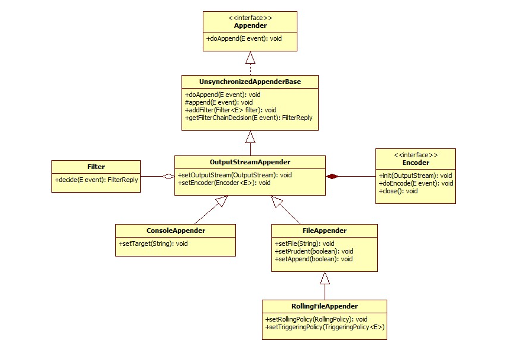

文章主要介绍SpringBoot日志门面与系统，详细说明LogBack

<!--more-->

# 1.日志简述

1. 现在大部分项目中使用的日志库可以分为**日志门面**和**日志库**（有点接口和实现类的感觉）
2. 使用日志库和其它组件一样分为**配置**和**api的使用**

## 1.1 日志门面

### 1.1.1 common-logging

common-logging 是 apache 的一个开源项目。也称Jakarta Commons Logging，缩写 JCL。

common-logging 的功能是提供日志功能的 API 接口，本身并不提供日志的具体实现（当然，common-logging 内部有一个 Simple logger 的简单实现，但是功能很弱，直接忽略），而是在运行时动态的绑定日志实现组件来工作（如 log4j、java.util.loggin）。

### 1.1.2 slf4j

全称为 Simple Logging Facade for Java，即 java 简单日志门面。

slf4j是项目中用的比较多的日志门户。类似于 Common-Logging，slf4j 是对不同日志框架提供的一个 API 封装，可以在部署的时候不修改任何配置即可接入一种日志实现方案。但是，slf4j 在编译时静态绑定真正的 Log 库。使用 SLF4J 时，如果你需要使用某一种日志实现，那么你必须选择正确的 SLF4J 的 jar 包的集合（各种桥接包）。

## 1.2 日志系统

### 1.2.1 不常用的日志系统

1. **java.util.logging（JUL）**
   官方提供的日志系统

2. **Log4j**

   Log4j 应该说是 Java 领域资格最老，应用最广的日志工具。Log4j 是高度可配置的，并可通过在运行时的外部文件配置。它根据记录的优先级别，并提供机制，以指示记录信息到许多的目的地，诸如：数据库，文件，控制台，UNIX 系统日志等。

   Log4j 的短板在于性能，在Logback 和 Log4j2 出来之后，Log4j的使用也减少了。

### 1.2.2 Logback

Logback 是由 log4j 创始人 Ceki Gulcu 设计的又一个开源日志组件，是作为 Log4j 的继承者来开发的，提供了性能更好的实现，异步 logger，Filter等更多的特性。

logback 当前分成三个模块：logback-core、logback-classic 和 logback-access。

+ logback-core - 是其它两个模块的基础模块。
+ logback-classic - 是 log4j 的一个 改良版本。此外 logback-classic 完整实现 SLF4J API 使你可以很方便地更换成其它日志系统如 log4j 或 JDK14 Logging。
+ logback-access - 访问模块与 Servlet 容器集成提供通过 Http 来访问日志的功能。

官网地址: http://logback.qos.ch/

### 1.2.3 Log4j2

维护 Log4j 的人为了性能又搞出了 Log4j2。

Log4j2 和 Log4j1.x 并不兼容，设计上很大程度上模仿了 SLF4J/Logback，性能上也获得了很大的提升。

Log4j2 也做了 Facade/Implementation 分离的设计，分成了 log4j-api 和 log4j-core。


# 2. logback

[放个官方教程](https://logback.qos.ch/manual/index.html)

logback是由原来log4j1的团队编写的，成为了log4j1的替代品，是项目中使用较多的日志系统

[官方给出使用logback而不是log4j1的原因](https://logback.qos.ch/reasonsToSwitch.html)

## 2.1 依赖导入

SpringBoot项目默认的日志实现就是logback，可以不导入任何依赖使用，如果不是Spring应用可以通过以下方式导入

```xml
<dependency>
  <groupId>ch.qos.logback</groupId>
  <artifactId>logback-classic</artifactId>
  <version>1.5.6</version>
</dependency>
```

项目中日志经常配合AOP使用，这里需要导入一下AOP的依赖

```xml
<!--aop的starter，也可以直接导入org.aspectj相关的包-->
<dependency>
    <groupId>org.springframework.boot</groupId>
    <artifactId>spring-boot-starter-aop</artifactId>
</dependency>
```

## 2.2 简单使用

```java
import org.aspectj.lang.ProceedingJoinPoint;
import org.aspectj.lang.annotation.Around;
import org.aspectj.lang.annotation.Aspect;
//建议导入slf4j中的类，优先使用日志门面(阿里开发规范)
import org.slf4j.Logger;
import org.slf4j.LoggerFactory;

import org.springframework.stereotype.Component;

import javax.servlet.http.HttpServletRequest;
import javax.servlet.http.HttpServletResponse;

@Aspect
@Component
public class WebLogAspect {
    public static final Logger logger= LoggerFactory.getLogger(WebLogAspect.class);
    //所有请求都会经过ServletRequest的service方法
    @Around("execution(public void javax.servlet.http.HttpServlet.service(..)))")
    public Object log(ProceedingJoinPoint jp) throws Throwable {
        Object[] args = jp.getArgs();
        HttpServletRequest request = (HttpServletRequest) args[0];
        HttpServletResponse response = (HttpServletResponse) args[1];
         String url = request.getRequestURL().toString();
        String method = request.getMethod();
        long startTime = System.currentTimeMillis();
        try{
            jp.proceed(new Object[]{request,response});
        }catch (Throwable e){
            throw e;
        }
        long time = (System.currentTimeMillis() - startTime);
        logger.info("请求路径为{},请求参数为{}",url,method);
        logger.info("响应状态码为{}",response.getStatus());
        logger.info("接口响应时间为{}ms",time);
        return null;
    }
}
```

这个切面会拦截所有请求，然后打印出请求的路径、参数，响应的状态码以及响应时间。AOP以及javaWeb的内容不是本文的重点，我们重点关注一下`Logger`

现在问题来了，这个`Logger`到底是什么？从`WebLogAspect.class`中getLogger是什么意思？logger.info()又是什么方法？

为了解答这些问题我们先来看看logback日志打印的一些组件（其实log4j1、logback、log4j2中组件都差不多，只是配置文件写法可能有点差异）

## 2.3 组件说明

### 2.3.1 Logger

logback中的记录器都会缓存在一个Map中（就像Spring缓存Bean那样），记录器Logger是有层级、有继承关系的（具体见LoggerContext）。

Logback的Logger是slf4j中Logger的实现，下面是logback中Logger的实现以及Logger的一些属性

```java
package ch.qos.logback.classic;

public final class Logger implements org.slf4j.Logger, LocationAwareLogger, AppenderAttachable<ILoggingEvent>, Serializable {
    public static final String FQCN = Logger.class.getName();
    private String name;
    private transient Level level;
    private transient int effectiveLevelInt;
    private transient Logger parent;
    private transient List<Logger> childrenList;
    //持有Appender
    private transient AppenderAttachableImpl<ILoggingEvent> aai;
    private transient boolean additive = true;
    final transient LoggerContext loggerContext;
}
```

#### Logger中的属性

- **name**：上面我们知道记录器是缓存在Map中的，这个**name**就是Map的**key**

  `LoggerFactory.getLogger()`的入参有两个，**name** 和 **class**，传入class的时候，name就是类的全限定名

- **Level**：我们知道日志是有级别的，比如上面调用的`info`，级别关系如下

  **TRACE** < **DEBUG** < **INFO** < **WARN** < **ERROR** < **FATAL** < **OFF**

  Logger中的Level表示这个Logger能支持打印的最低级别，默认是 **DEBUG**，当调用低于Level级别日志打印方法时会没有显示（可以把上面代码改成trace()方法试试）

- **parent**与**childrenList**

  用来维护Logger层级关系的属性，`getLogger()`时会先从Map里面拿，取不到的时候再创建，Logger创建时会检测有无父Logger，没有的话会创建父Logger，然后会检测父Logger有无父Logger，循环往上直到碰到顶级Logger（name为ROOT的Logger）。

  **举例**：

  ```java
  //我项目中的类的全限定名是org.example.demo.aspect.WebLogAspect
  public static final Logger logger= LoggerFactory.getLogger(WebLogAspect.class);
  ```

  那么创建的时候就会先检测是否有**name**为**"WebLogAspect"**的Logger，没有的话再检测是否有 **name**为 **aspect**的Logger，又没有的话会检测是否有 **name**为 **demo**的Logger ... 直到检测到没有 **name**为**org**的Logger ，**org的父类是 "ROOT"**，这时会根据ROOT中的属性来创建 **"org"**，根据 **"org"**创建 **"example"**直到 **"WebLogAspect"**被创建

  系统默认的属性都会放在**"ROOT"**中，比如上面说的Level默认是DEBUG

### 2.3.2 appender

Logger会将输出日志的任务交给Appender（附加器）来完成，不同的Appender会将日志打印到不同的地方，比如控制台附加器、文件附加器、网络附加器

Logback中的appender是一个接口，以下是官网扒下来的结构图



除了`UnsynchronizedAppenderBase`，Appender的基本实现还有一个`AppenderBase`，这两者的区别看名字就能猜到

```java
//AppenderBase的实现，加上了同步字段synchronized
public synchronized void doAppend(E eventObject) {...}
//`UnsynchronizedAppenderBase的实现
public void doAppend(E eventObject) {...}
```

#### Logger与Appender的关联

```java
public final class Logger implements org.slf4j.Logger, LocationAwareLogger, AppenderAttachable<ILoggingEvent>, Serializable {
    
    private transient AppenderAttachableImpl<ILoggingEvent> aai;
    
    //日志打印方法经过层层处理，最终会调用这个方法
     public int appendLoopOnAppenders(E e) {
        int size = 0;
        Appender<E>[] appenderArray = (Appender[])this.appenderList.asTypedArray();
        int len = appenderArray.length;
         //调用每个Appender执行doAppend方法
        for(int i = 0; i < len; ++i) {
            appenderArray[i].doAppend(e);
            ++size;
        }

        return size;
    }
}
public class AppenderAttachableImpl<E> implements AppenderAttachable<E> {
    //Appender的持有，COWArrayList是logback自定义的List
    private final COWArrayList<Appender<E>> appenderList = new COWArrayList(new Appender[0]);
}
```

### 2.3.3 信息的过滤以及处理

#### filter

Filter是用来决定附加器是否输出日志的，与Appender的关系如下

```java
public abstract class UnsynchronizedAppenderBase<E> extends ContextAwareBase implements Appender<E> {
    //存放Filter的属性 (有亿点点眼熟)
	private FilterAttachableImpl<E> fai = new FilterAttachableImpl();
}
```

每个过滤器都会返回一个枚举值，枚举的值有：DENY、NEUTRAL、ACCEPT。

附加器会根据过滤器的返回值来判断是否输出日志：

- DENY：不输出日志
- NEUTRAL：中立
- ACCPET：输出日志

多个过滤器的情况下，会以链式的方式进行过滤，当过滤器的返回值为 **DENY**、**ACCPET**时，会直接决定附加器是否打印日志；当过滤器返回值为 **NEUTRAL**时会执行判断下一个过滤器，直达出现返回值为 **DENY**、**ACCPET**或者没有过滤器结束，最后一个过滤器的返回值为 **NEUTRAL**也会打印日志

#### encoder

Encoders are responsible for transforming an incoming event into a byte array（官方原话，负责将需要打印的event转成字节数组）

```java
public interface Encoder<E> extends ContextAware, LifeCycle {
    byte[] headerBytes();

    byte[] encode(E var1);

    byte[] footerBytes();
}
```

通俗的来说Encoder是用来将信息格式化输出的

## 2.4 配置文件

### 2.4.1 spring 配置文件

先来看看Spring配置文件中能配置的属性（application的配置粒度不够细，并且不利于更换日志系统，所以项目一般不会直接在application中配置日志信息）

```yaml
logging:
  level:
    #配置全部的调试级别
    #root: trace
    #配置具体包路径下的调试级别
    com.example.springboot03: trace
  pattern:
    #默认控制台输出格式
    console: '%clr(%d{${LOG_DATEFORMAT_PATTERN:-yyyy-MM-dd HH:mm:ss.SSSXXX}})'
    dateformat: yyyy-MM-dd HH:mm:ss
  file:
    #设置文件名称，没有设置路径的话，默认在项目相对路径下生成 （name优先级 > path优先级）
    name: F:/WorkSpaceSpringBoot/my.log
    #不可以指定文件名称，必须指定物理文件夹路径，默认使用 spring.log 进行输出
    #path: F:/WorkSpaceSpringBoot/
  logback:
    rolling policy:
      #启动是否清空日志文件，默认false
      clean-history-on-start: false
      #保存文件的默认命名格式
      file-name-pattern: '${LOG_FILE}.%d{yyyy-MM-dd}.%i.gz'
      #最大日志文件大小 日志文件多大归档一次(单位必须大写)
      max-file-size: 2KB
      # 日志保存天数
      max-history: 7
      # 日志保存总大小 超出就删除旧的文档,按时间先后删除 (0B就是没有限制)
      total-size-cap: 4KB
```

### 2.4.2 logback配置文件(可以说是logback的核心了)

文件名为"logback-spring.xml"

```xml
<?xml version="1.0" encoding="UTF-8"?>
<configuration debug="false">

    <!--定义日志文件的存储地址 勿在 LogBack 的配置中使用相对路径-->
    <property name="LOG_HOME" value="/home" />

    <!--控制台日志， 控制台输出 -->
    <appender name="STDOUT" class="ch.qos.logback.core.ConsoleAppender">
        <encoder class="ch.qos.logback.classic.encoder.PatternLayoutEncoder">
            <!--格式化输出：%d表示日期，%thread表示线程名，%-5level：级别从左显示5个字符宽度,%msg：日志消息，%n是换行符-->
            <pattern>%d{yyyy-MM-dd HH:mm:ss.SSS} [%thread] %-5level %logger{50} - %msg%n</pattern>
        </encoder>
    </appender>

    <!--文件日志， 按照每天生成日志文件 -->
    <appender name="FILE" class="ch.qos.logback.core.rolling.RollingFileAppender">
        <rollingPolicy class="ch.qos.logback.core.rolling.TimeBasedRollingPolicy">
            <!--日志文件输出的文件名-->
            <FileNamePattern>${LOG_HOME}/TestWeb.log.%d{yyyy-MM-dd}.log</FileNamePattern>
            <!--日志文件保留天数-->
            <MaxHistory>30</MaxHistory>
        </rollingPolicy>
        <encoder class="ch.qos.logback.classic.encoder.PatternLayoutEncoder">
            <!--格式化输出：%d表示日期，%thread表示线程名，%-5level：级别从左显示5个字符宽度，%msg：日志消息，%n是换行符-->
            <pattern>%d{yyyy-MM-dd HH:mm:ss.SSS} [%thread] %-5level %logger{50} - %msg%n</pattern>
            <!-- 设置编码格式，以防中文乱码 -->
            <charset class="java.nio.charset.Charset">UTF-8</charset>
        </encoder>
        <!--日志文件最大的大小-->
        <triggeringPolicy class="ch.qos.logback.core.rolling.SizeBasedTriggeringPolicy">
            <MaxFileSize>10MB</MaxFileSize>
        </triggeringPolicy>
    </appender>
    
    
    <!--修改框架中的Logger-->
    <logger name="com.apache.ibatis" level="TRACE"/>
    <logger name="java.sql.Connection" level="DEBUG"/>
    <logger name="java.sql.Statement" level="DEBUG"/>
    <logger name="java.sql.PreparedStatement" level="DEBUG"/>

    <!-- 修改root会修改所有的Logger,包括框架中的日志打印 -->
    <root level="DEBUG">
        <appender-ref ref="STDOUT" />
        <appender-ref ref="FILE"/>
    </root>
</configuration>
```


# 参考

[Logback Manual](https://logback.qos.ch/manual/index.html)
