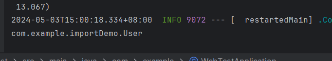
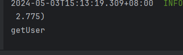

SpringBoot自动装配 = 模块装配 + 条件装配

`@SpringBootApplication`上标注了`@EnableAutoConfiguration`，这自动装配的起点。

1. 导入starter及Spring运行需要的类

   - `@EnableAutoConfiguration `上标注了`@Import(AutoConfigurationImportSelector.class)`

   - 根据模块装配规则`AutoConfigurationImportSelector`的父类实现了`ImportSelector`接口，重写了`selectImports()`方法。
   - Spring内部通过层层过滤，最终委托给`SpringFactoriesLoader`中`loadFactoryNames()`方法来调用`loadSpringFactories()`，并过滤返回值key是`EnableAutoConfiguration`的value
   - `loadSpringFactories()`方法会解析资源目录下"META-INF/spring.factories"文件，并将数据封装成Map类型
   - 之后将得到的数据层层返回上去，在selectImports()返回要加载的类名（也就是META-INF/spring.factories文件中定义的EnableAutoConfiguration的类）

2. 导入自己编写的Bean
   - `@AutoConfigurationPackage`上标注了`@Import(AutoConfigurationPackages.Registrar.class)`
   - 根据模块装配规则``AutoConfigurationPackages.Registrar`实现了`ImportBeanDefinitionRegistrar`接口，重写了`registerBeanDefinitions()`方法。
   - `registerBeanDefinitions()`会调用`register()`方法来注册`PackageImports`中封装的包名
   - `PackageImports`会解析是否配置需要扫描的包名，默认是启动类所在包

<!-- more -->

# 1. Spring中的装配

Tips：框架源码类文章建议自己打开IDEA跟着看看类之间的关系

## 1.1 模块装配

模块装配主要是通过`@Import`注解来实现的，听名字就知道是用来导入类的。

```java
//Spring中著名的EnableAutoConfiguration注解
@Target({ElementType.TYPE})
@Retention(RetentionPolicy.RUNTIME)
@Documented
@Inherited
@AutoConfigurationPackage
//不是导入类吗？这导入了个什么玩意儿?
@Import({AutoConfigurationImportSelector.class})
public @interface EnableAutoConfiguration {
    String ENABLED_OVERRIDE_PROPERTY = "spring.boot.enableautoconfiguration";

    Class<?>[] exclude() default {};

    String[] excludeName() default {};
}
```

Import注解源码

```java
/* @author Chris Beams
 * @author Juergen Hoeller
 * @since 3.0
 * @see Configuration
 * @see ImportSelector
 * @see ImportBeanDefinitionRegistrar
 * @see ImportResource
 */
@Target(ElementType.TYPE)
@Retention(RetentionPolicy.RUNTIME)
@Documented
public @interface Import {
	/**
	 * {@link Configuration @Configuration}, {@link ImportSelector},
	 * {@link ImportBeanDefinitionRegistrar}, or regular component classes to import.
	 */
	Class<?>[] value();

}
```

很清楚的看到了四种导入方式`Configuration`，`ImportSelector`、`ImportBeanDefinitionRegistrar`、`ImportResource`

### 1. ImportResource（导入普通类）

需要导入的User类

```java
@Getter
@Setter
@NoArgsConstructor
@AllArgsConstructor
class User{
    private Long id;
    private String name;
}
```

自定义的注解

```java
@Target({ElementType.TYPE})
@Retention(RetentionPolicy.RUNTIME)
@Import(User.class)
public @interface EnableUser {

}
```

启动类

```java
@SpringBootApplication
//标注自定义注解，也可以标注在配置类等地方
@EnableUser
public class WebTestApplication {
    public static void main(String[] args) {
        ConfigurableApplicationContext context = SpringApplication.run(WebTestApplication.class, args);
        String[] beanNamesForType = context.getBeanNamesForType(User.class);
        System.out.println(beanNamesForType[0]);
    }
}
```

成功打印出了User



### 2. Configuration (导入配置类)

建立配置类，将配置类放到启动类包扫描不到的地方（默认会扫描主启动类所在包下的所有类，我这里就直接放在主启动类包上）

```java
@Configuration
public class ImportConfiguration {
    @Bean
    public User getUser(){
        User user = new User();
        user.setId(36L);
        user.setName("ruizhi");
        return user;
    }
}
```

修改注解

```java
@Target({ElementType.TYPE})
@Retention(RetentionPolicy.RUNTIME)
@Import(User.class)
public @interface EnableUser {

}
```

测试，依旧可以打印出信息（具体对象注入名称问题，自行查阅）

```java
@SpringBootApplication
@EnableUser
public class WebTestApplication {
    public static void main(String[] args) {
        ConfigurableApplicationContext context = SpringApplication.run(WebTestApplication.class, args);
        String[] beanNamesForType = context.getBeanNamesForType(User.class);
        System.out.println(beanNamesForType[0]);
    }
}
```



### 3. ImportSelector（导入Selector）

ImportSelector接口

```java
public interface ImportSelector {

    /**
     * Select and return the names of which class(es) should be imported based on
     * the {@link AnnotationMetadata} of the importing @{@link Configuration} class.
     * @return the class names, or an empty array if none
     */
    //返回要导入的类的全限定类名
    String[] selectImports(AnnotationMetadata importingClassMetadata);
}
```

自定义Selector类实现ImportSelector接口

```java
public class UserSelector implements ImportSelector {
    @Override
    public String[] selectImports(AnnotationMetadata importingClassMetadata) {
        //导入User类
        return new String[]{User.class.getName()};
    }
}
```

注解更改，主启动类不需要更改

```java
@Target({ElementType.TYPE})
@Retention(RetentionPolicy.RUNTIME)
@Import(UserSelector.class)
public @interface EnableUser {

}
```

测试结果和方式1相同

### 4. ImportBeanDefinitionRegistrar（导入BeanDefinition）

修改Selector类

```java
public class UserSelector implements ImportBeanDefinitionRegistrar {
    @Override
    public void registerBeanDefinitions(AnnotationMetadata metadata, BeanDefinitionRegistry registry) {
        //传入Bean id和BeanDefinition, 这里直接new了一个
        registry.registerBeanDefinition("ruizhi", new RootBeanDefinition(User.class));
    }
}
```

结果打印名称就是上面类注册的名称（我这打印的是"ruizhi")

## 1.2 条件装配

### 1. Conditional

稍微深入了解过Spring的老哥可能就会很清楚，Spring里面有一套`@Conditional`注解，最常见的就是`@ConditionalOnMissingBean(String[] BeanName)`（没有相应Bean就注入），`@ConditionalOnClass`（有相应Class就注入），有Bean就注入、没有class就注入等一堆注解。

**作用**：有了这些注解我们就可以很轻松的自定类来覆盖掉原本要自动装配的类

```java
//万恶之源，所有Conditional注解的根
@Target({ElementType.TYPE, ElementType.METHOD})
@Retention(RetentionPolicy.RUNTIME)
@Documented
public @interface Conditional {

	/**
	 * All {@link Condition} classes that must {@linkplain Condition#matches match}
	 * in order for the component to be registered.
	 */
	Class<? extends Condition>[] value();

}
```

Conditional会根据Condition来判断是否装配

```java
@FunctionalInterface
public interface Condition {

    /**
     * Determine if the condition matches.
     * @param context the condition context
     * @param metadata the metadata of the {@link org.springframework.core.type.AnnotationMetadata class}
     * or {@link org.springframework.core.type.MethodMetadata method} being checked
     * @return {@code true} if the condition matches and the component can be registered,
     * or {@code false} to veto the annotated component's registration
     */
    //返回值为true，则注入相关Bean
    boolean matches(ConditionContext context, AnnotatedTypeMetadata metadata);
}
```

到这里我们可以想到，所有衍生出的注解都是根据匹配规则实现了自己`matches()`方法。

看看`ConditionalOnMissingBean`验证下想法

```java
@Target({ElementType.TYPE, ElementType.METHOD})
@Retention(RetentionPolicy.RUNTIME)
@Documented
@Conditional({OnBeanCondition.class})
public @interface ConditionalOnMissingBean {
    Class<?>[] value() default {};

    String[] type() default {};

    Class<?>[] ignored() default {};

    String[] ignoredType() default {};

    Class<? extends Annotation>[] annotation() default {};

    String[] name() default {};

    SearchStrategy search() default SearchStrategy.ALL;

    Class<?>[] parameterizedContainer() default {};
}

```

这时候你自信满满的打开IDEA看了下源码，在OnBeanCondition里面怎么都没找到matches()方法，只有一个 `getMatchOutcome()`？？？怎么回事？

```java
@Order(Ordered.LOWEST_PRECEDENCE)
class OnBeanCondition extends FilteringSpringBootCondition implements ConfigurationCondition {
    @Override
	public ConditionOutcome getMatchOutcome(ConditionContext context, AnnotatedTypeMetadata metadata) {
		ConditionMessage matchMessage = ConditionMessage.empty();
		MergedAnnotations annotations = metadata.getAnnotations();
		if (annotations.isPresent(ConditionalOnBean.class)) {
			Spec<ConditionalOnBean> spec = new Spec<>(context, metadata, annotations, ConditionalOnBean.class);
			MatchResult matchResult = getMatchingBeans(context, spec);
			if (!matchResult.isAllMatched()) {
				String reason = createOnBeanNoMatchReason(matchResult);
				return ConditionOutcome.noMatch(spec.message().because(reason));
			}
			matchMessage = spec.message(matchMessage).found("bean", "beans").items(Style.QUOTE,
					matchResult.getNamesOfAllMatches());
		}
		if (metadata.isAnnotated(ConditionalOnSingleCandidate.class.getName())) {
			Spec<ConditionalOnSingleCandidate> spec = new SingleCandidateSpec(context, metadata, annotations);
			MatchResult matchResult = getMatchingBeans(context, spec);
			if (!matchResult.isAllMatched()) {
				return ConditionOutcome.noMatch(spec.message().didNotFind("any beans").atAll());
			}
			else if (!hasSingleAutowireCandidate(context.getBeanFactory(), matchResult.getNamesOfAllMatches(),
					spec.getStrategy() == SearchStrategy.ALL)) {
				return ConditionOutcome.noMatch(spec.message().didNotFind("a primary bean from beans")
						.items(Style.QUOTE, matchResult.getNamesOfAllMatches()));
			}
			matchMessage = spec.message(matchMessage).found("a primary bean from beans").items(Style.QUOTE,
					matchResult.getNamesOfAllMatches());
		}
		if (metadata.isAnnotated(ConditionalOnMissingBean.class.getName())) {
			Spec<ConditionalOnMissingBean> spec = new Spec<>(context, metadata, annotations,
					ConditionalOnMissingBean.class);
			MatchResult matchResult = getMatchingBeans(context, spec);
			if (matchResult.isAnyMatched()) {
				String reason = createOnMissingBeanNoMatchReason(matchResult);
				return ConditionOutcome.noMatch(spec.message().because(reason));
			}
			matchMessage = spec.message(matchMessage).didNotFind("any beans").atAll();
		}
		return ConditionOutcome.match(matchMessage);
	}
}
```

那就去看看父类吧，果然最终在`FilteringSpringBootCondition`父类`SpringBootCondition`里找到了答案

可以看到Spring对`matches()`方法进行了一层的封装，在`SpringBootCondition`里`matches()`方法会调用抽象的`getMatchOutcome`(有种模版模式的感觉)，子类只需要实现`getMatchOutcome()`就行了

```java
public abstract class SpringBootCondition implements Condition {
	public final boolean matches(ConditionContext context, AnnotatedTypeMetadata metadata) {
		String classOrMethodName = getClassOrMethodName(metadata);
		try {
			ConditionOutcome outcome = getMatchOutcome(context, metadata);
			logOutcome(classOrMethodName, outcome);
			recordEvaluation(context, classOrMethodName, outcome);
			return outcome.isMatch();
		}
		catch (NoClassDefFoundError ex) {
			throw new IllegalStateException("Could not evaluate condition on " + classOrMethodName + " due to "
					+ ex.getMessage() + " not found. Make sure your own configuration does not rely on "
					+ "that class. This can also happen if you are "
					+ "@ComponentScanning a springframework package (e.g. if you "
					+ "put a @ComponentScan in the default package by mistake)", ex);
		}
		catch (RuntimeException ex) {
			throw new IllegalStateException("Error processing condition on " + getName(metadata), ex);
		}
	}
}
```

### 2. Profile

除了Conditional，Spring中还有`@profile`注解来根据环境来注入Bean。

**Environment**（环境）:Spring会把一些信息封装到Environment对象中，比如application.properties中的内容

```java
//继承PropertyResolver来解析资源
public interface Environment extends PropertyResolver {
    String[] getActiveProfiles();

    String[] getDefaultProfiles();

    /** @deprecated */
    @Deprecated
    boolean acceptsProfiles(String... var1);

    boolean acceptsProfiles(Profiles var1);
}
```

测试，别忘了把Configuration路径改回来

```java
public class WebTestApplication {
    public static void main(String[] args) {
        /*需要再容器refresh()之前传入profile值，可以在启动前设置参数`-DSpring.profiles.active=ruizhi`，这里就直接new一个context了*/
        AnnotationConfigApplicationContext ctx = new AnnotationConfigApplicationContext();
        ctx.getEnvironment().setActiveProfiles("ruizhi");
        ctx.register(ImportConfiguration.class);
        ctx.refresh();
        String[] beanNamesForType = ctx.getBeanNamesForType(User.class);
        System.out.println(beanNamesForType[0]);
    }
}
```

加上profile注解，(可以更改值，自行观察是否注入User)

```java
@Configuration
public class ImportConfiguration {

    @Bean
    @Profile("ruizhi")
    public User getUser(){
        User user = new User();
        user.setId(36L);
        user.setName("ruizhi");
        return user;
    }

}
```

### 小结

- `@Conditional`主要是用来让用户能根据具体业务场景自己配置或者自定义Bean来满足需求
- `@Profile`主要是为了针对不同的环境提供不同的Bean（本地测试与线上生产环境的日志打印路径、数据库等组件使用肯定不同）

# 2. SpringBoot自动装配

点开注解`@SpringBootApplication`，你会发现上面标注了一个`@EnableAutoConfiguration`（允许自动装配）

```java
@Target(ElementType.TYPE)
@Retention(RetentionPolicy.RUNTIME)
@Documented
@Inherited
@AutoConfigurationPackage
@Import(AutoConfigurationImportSelector.class)
public @interface EnableAutoConfiguration {

	/**
	 * Environment property that can be used to override when auto-configuration is
	 * enabled.
	 */
	String ENABLED_OVERRIDE_PROPERTY = "spring.boot.enableautoconfiguration";

	/**
	 * Exclude specific auto-configuration classes such that they will never be applied.
	 * @return the classes to exclude
	 */
	Class<?>[] exclude() default {};

	/**
	 * Exclude specific auto-configuration class names such that they will never be
	 * applied.
	 * @return the class names to exclude
	 * @since 1.3.0
	 */
	String[] excludeName() default {};

}
```

可以看到`EnableAutoConfiguration`导入了`AutoConfigurationImportSelector.class`，继续深入看看

## 2.1 AutoConfigurationImportSelector

```java
//模块装配中导入Selector的方式
public class AutoConfigurationImportSelector implements DeferredImportSelector, BeanClassLoaderAware,
		ResourceLoaderAware, BeanFactoryAware, EnvironmentAware, Ordered {
    
          ...    
     //只要在这个方法返回类的全限定名就行了
	@Override
	public String[] selectImports(AnnotationMetadata annotationMetadata) {
		if (!isEnabled(annotationMetadata)) {
			return NO_IMPORTS;
		}
         //加载自动配置类，拿到类的全限定名
		AutoConfigurationEntry autoConfigurationEntry = getAutoConfigurationEntry(annotationMetadata);
		return StringUtils.toStringArray(autoConfigurationEntry.getConfigurations());
	}
            
     protected AutoConfigurationEntry getAutoConfigurationEntry(AnnotationMetadata annotationMetadata) {
		if (!isEnabled(annotationMetadata)) {
			return EMPTY_ENTRY;
		}
		AnnotationAttributes attributes = getAttributes(annotationMetadata);
         //加载候选类
		List<String> configurations = getCandidateConfigurations(annotationMetadata, attributes);
		configurations = removeDuplicates(configurations);
		Set<String> exclusions = getExclusions(annotationMetadata, attributes);
		checkExcludedClasses(configurations, exclusions);
		configurations.removeAll(exclusions);
		configurations = getConfigurationClassFilter().filter(configurations);
		fireAutoConfigurationImportEvents(configurations, exclusions);
		return new AutoConfigurationEntry(configurations, exclusions);
	}
            
      protected List<String> getCandidateConfigurations(AnnotationMetadata metadata, AnnotationAttributes attributes) {
          //通过SpringFactoriesLoader加载类名
		List<String> configurations = SpringFactoriesLoader.loadFactoryNames(getSpringFactoriesLoaderFactoryClass(),
				getBeanClassLoader());
		Assert.notEmpty(configurations, "No auto configuration classes found in META-INF/spring.factories. If you "
				+ "are using a custom packaging, make sure that file is correct.");
		return configurations;
	}return configurations;
	}
            
}
```

可以看到经过层层封装，Spring把具体加载的过程委托给了**SpringFactoriesLoader**类，（终于可以到具体的加载逻辑了。

```java
public final class SpringFactoriesLoader {
    public static final String FACTORIES_RESOURCE_LOCATION = "META-INF/spring.factories";
    
	public static List<String> loadFactoryNames(Class<?> factoryType, @Nullable ClassLoader classLoader) {
        //factoryTypeName是EnableAutoConfiguration
		String factoryTypeName = factoryType.getName();
        //封装成Map，返回key是EnableAutoConfiguration的类名
		return loadSpringFactories(classLoader).getOrDefault(factoryTypeName, Collections.emptyList());
	}

	private static Map<String, List<String>> loadSpringFactories(@Nullable ClassLoader classLoader) {
		MultiValueMap<String, String> result = cache.get(classLoader);
		if (result != null) {
			return result;
		}

		try {
            //加载路径就是META-INF/spring.factories
			Enumeration<URL> urls = (classLoader != null ?
					classLoader.getResources(FACTORIES_RESOURCE_LOCATION) :
					ClassLoader.getSystemResources(FACTORIES_RESOURCE_LOCATION));
			result = new LinkedMultiValueMap<>();
            //遍历文件并把它放到缓存里
			while (urls.hasMoreElements()) {
				URL url = urls.nextElement();
				UrlResource resource = new UrlResource(url);
				Properties properties = PropertiesLoaderUtils.loadProperties(resource);
				for (Map.Entry<?, ?> entry : properties.entrySet()) {
					String factoryTypeName = ((String) entry.getKey()).trim();
					for (String factoryImplementationName : StringUtils.commaDelimitedListToStringArray((String) entry.getValue())) {
						result.add(factoryTypeName, factoryImplementationName.trim());
					}
				}
			}
			cache.put(classLoader, result);
			return result;
		}
		catch (IOException ex) {
			throw new IllegalArgumentException("Unable to load factories from location [" +
					FACTORIES_RESOURCE_LOCATION + "]", ex);
		}
	}
```

通过上述过程我们也就可以想到Spring加载Starter，也是加载了starter资源目录下`META-INF/spring.factories`文件，当然自定义Starter也可以通过编写这一文件将需要的Bean导入到容器中。

## 2.2 @AutoConfigurationPackage

先点进去看看

```java
@Target(ElementType.TYPE)
@Retention(RetentionPolicy.RUNTIME)
@Documented
@Inherited
@Import(AutoConfigurationPackages.Registrar.class)
public @interface AutoConfigurationPackage {

	/**
	 * Base packages that should be registered with {@link AutoConfigurationPackages}.
	 * <p>
	 * Use {@link #basePackageClasses} for a type-safe alternative to String-based package
	 * names.
	 * @return the back package names
	 * @since 2.3.0
	 */
	String[] basePackages() default {};

	/**
	 * Type-safe alternative to {@link #basePackages} for specifying the packages to be
	 * registered with {@link AutoConfigurationPackages}.
	 * <p>
	 * Consider creating a special no-op marker class or interface in each package that
	 * serves no purpose other than being referenced by this attribute.
	 * @return the base package classes
	 * @since 2.3.0
	 */
	Class<?>[] basePackageClasses() default {};

}
```

可以看到`AutoConfigurationPackage`上面还有一个Import注解，导入了`AutoConfigurationPackages.Registrar.class`，继续往下看看

```java
//模块装配中导入BeanDefinition的方式
static class Registrar implements ImportBeanDefinitionRegistrar, DeterminableImports {

		@Override
		public void registerBeanDefinitions(AnnotationMetadata metadata, BeanDefinitionRegistry registry) {
            //调用外部的register方法，AnnotationMetadata是被标注注解的类的元信息（这里主要是为了获取主类包名）
            //关于AnnotationMetadata以及BeanDefinitionRegistry的相关信息自行查阅
			register(registry, new PackageImports(metadata).getPackageNames().toArray(new String[0]));
		}
		@Override
		public Set<Object> determineImports(AnnotationMetadata metadata) {
			return Collections.singleton(new PackageImports(metadata));
		}

	}
```

但是PackageImports是什么？点进去看看

```java
private static final class PackageImports {

		private final List<String> packageNames;

		PackageImports(AnnotationMetadata metadata) {
			AnnotationAttributes attributes = AnnotationAttributes
					.fromMap(metadata.getAnnotationAttributes(AutoConfigurationPackage.class.getName(), false));
			List<String> packageNames = new ArrayList<>();
            //判断自己有没有配置basePackages
			for (String basePackage : attributes.getStringArray("basePackages")) {
				packageNames.add(basePackage);
			}
			for (Class<?> basePackageClass : attributes.getClassArray("basePackageClasses")) {
				packageNames.add(basePackageClass.getPackage().getName());
			}
            //默认空的会自动添加类的包路径
			if (packageNames.isEmpty()) {
				packageNames.add(ClassUtils.getPackageName(metadata.getClassName()));
			}
			this.packageNames = Collections.unmodifiableList(packageNames);
		}
	}
```

# 3. 总结

`@SpringBootApplication`上标注了`@EnableAutoConfiguration`，这自动装配的起点。

1. 导入starter及Spring运行需要的类

   - `@EnableAutoConfiguration `上标注了`@Import(AutoConfigurationImportSelector.class)`

   - 根据模块装配规则`AutoConfigurationImportSelector`的父类实现了`ImportSelector`接口，重写了`selectImports()`方法。
   - Spring内部通过层层过滤，最终委托给`SpringFactoriesLoader`中`loadFactoryNames()`方法来调用`loadSpringFactories()`，并过滤返回值key是`EnableAutoConfiguration`的value
   - `loadSpringFactories()`方法会解析资源目录下"META-INF/spring.factories"文件，并将数据封装成Map类型
   - 之后将得到的数据层层返回上去，在selectImports()返回要加载的类名（也就是META-INF/spring.factories文件中定义的EnableAutoConfiguration的类）

2. 导入自己编写的Bean
   - `@AutoConfigurationPackage`上标注了`@Import(AutoConfigurationPackages.Registrar.class)`
   - 根据模块装配规则``AutoConfigurationPackages.Registrar`实现了`ImportBeanDefinitionRegistrar`接口，重写了`registerBeanDefinitions()`方法。
   - `registerBeanDefinitions()`会调用`register()`方法来注册`PackageImports`中封装的包名
   - `PackageImports`会解析是否配置需要扫描的包名，默认是启动类所在包

