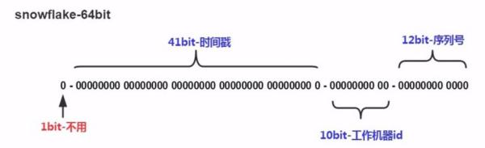

分布式场景下全局唯一id的生成方案，雪花算法、数据库自增、redis自增。

<!--more-->

# 1. 雪花算法

## 1.1 结构



- 41bit时间戳：这里采用的就是当前系统的具体时间，单位为毫秒
- 10bit工作机器ID（workerId）：每台机器分配一个id，这样可以标示不同的机器，但是上限为1024，标示一个集群某个业务最多部署的机器个数上限
- 12bit序列号（自增域）：表示在某一毫秒下，这个自增域最大可以分配的bit个数，在当前这种配置下，每一毫秒可以分配2^12个数据，也就是说QPS可以到 409.6 w/s。

## 1.2 代码实现

可以用hutool中的工具类`IdUtil`来创建雪花算法生成的id

1. 导入`hutool`

   ```java
   <dependency>
      <groupId>cn.hutool</groupId>
      <artifactId>hutool-all</artifactId>
      <version>5.7.2</version>
   </dependency>
   ```

2. 使用`IdUtil`

   ```java
   IdUtil.createSnowflake(0L,1L);
   //传入参数是workerId和datacenterId
    public static Snowflake createSnowflake(long workerId, long datacenterId) {
           return new Snowflake(workerId, datacenterId);
       }
   ```

**代码剖析：**

1. **初始化**

   ```java
   //上方函数调用的构造参数，进行初始化
   public Snowflake(long workerId, long dataCenterId) {
           this(workerId, dataCenterId, false);
       }
   
       public Snowflake(long workerId, long dataCenterId, boolean isUseSystemClock) {
           this((Date)null, workerId, dataCenterId, isUseSystemClock);
       }
   
       public Snowflake(Date epochDate, long workerId, long dataCenterId, boolean isUseSystemClock) {
           this.workerIdBits = 5L;
           //最大workerId，5位也就是2^5-1
           this.maxWorkerId = 31L;
           
           this.dataCenterIdBits = 5L;
           //最大dataCenterId，5位也就是2^5-1
           this.maxDataCenterId = 31L;
           
           this.sequenceBits = 12L;
           this.workerIdShift = 12L;
           this.dataCenterIdShift = 17L;
           this.timestampLeftShift = 22L;
           //最大序列号，2^12 - 1
           this.sequenceMask = 4095L;
           this.sequence = 0L;
           this.lastTimestamp = -1L;
           
           //使用工具类传的是null
           if (null != epochDate) {
               this.twepoch = epochDate.getTime();
           } else {
               this.twepoch = 1288834974657L;
           }
   
           if (workerId <= 31L && workerId >= 0L) {
               if (dataCenterId <= 31L && dataCenterId >= 0L) {
                   this.workerId = workerId;
                   this.dataCenterId = dataCenterId;
                   this.useSystemClock = isUseSystemClock;
               } else {
                   throw new IllegalArgumentException(StrUtil.format("datacenter Id can't be greater than {} or less than 0", new Object[]{31L}));
               }
           } else {
               throw new IllegalArgumentException(StrUtil.format("worker Id can't be greater than {} or less than 0", new Object[]{31L}));
           }
       }
   
   ```

2. **具体创建逻辑**

   ```java
   public synchronized long nextId() {
       //生成的时间戳13位，默认的twepoch也是13位
           long timestamp = this.genTime();
       //时间片回拨问题，时间差较小进行同步,时间差较大直接抛异常
           if (timestamp < this.lastTimestamp) {
               if (this.lastTimestamp - timestamp >= 2000L) {
                   throw new IllegalStateException(StrUtil.format("Clock moved backwards. Refusing to generate id for {}ms", new Object[]{this.lastTimestamp - timestamp}));
               }
               timestamp = this.lastTimestamp;
           }
       //序号自增,增到最大再次将时间戳更新(防止id重复)
           if (timestamp == this.lastTimestamp) {
               long sequence = this.sequence + 1L & 4095L;
               if (sequence == 0L) {
                   timestamp = this.tilNextMillis(this.lastTimestamp);
               }
   
               this.sequence = sequence;
           } else {
               this.sequence = 0L;
           }
   
           this.lastTimestamp = timestamp;
       //创建Id，(时间戳 - 1288834974657L) + 五位的dtaCenterId + 五位的workerId + 12位序列号
       //很符合雪花算法的结构 时间戳 + 10位机器Id + 12位序列号
           return timestamp - this.twepoch << 22 | this.dataCenterId << 17 | this.workerId << 12 | this.sequence;
       }
   ```

## 1.3 问题

雪花算法可能出现以下问题

- **时间片回拨**：由于机器的时间是动态的调整的，有可能会出现时间跑到之前几毫秒，如果这个时候获取到了这种时间，则会出现**id重复**
- **机器id分配以及回收**：机器id需要每台机器不一样，这样的方式分配需要有方案进行处理，同时也要考虑，如果该机器宕机了，对应的workerId分配后的回收问题
- **机器id上线**：机器id是固定的bit，那么也就是对应的机器个数是有上限的，在有些业务场景下，需要所有机器共享同一个业务空间，那么10bit表示的1024台机器是不够的。

**解决方案**

问题的处理没有完美的方案，只要选一个适合自身业务场景的就行

1. **时间回拨问题**

   - 出现回拨直接抛异常
   - 采用等待跟上次时间的一段范围：这种算是简单解决，可以接受，但是如果等待一段时间后再出现回拨，则抛异常。（hutool工具包中就采用的这种方案）

2. **机器id上限**

   这个问题受限于雪花算法的结构，除非改一下雪花算法增加机器Id位数，不然没法解决

### 机器id分配问题

**机器id分配问题**比起雪花算法，它和业务的关联性更大，这里单独拿出来说一下。

在上面代码中，我们使用hutool工具包随便传入了两个值作为workerId和datacenterId，但真实生产环境中这两个值是需要有一套分配策略来产生的（多个不同的Java程序使用相同的机器id可能会导致id重复生成）。

**需求**：

1. 机器id需要能够不重复的分配给所有JVM实例
2. 机器id数量有限，需要对不使用的机器id进行回收复用

#### 1.3.1 直接使用ip地址

服务器的IP地址一般都是公司的内网IP，子网划分时同一子网IP的前几位基本是相同的，根据这一特性我们可以在IP地址中取10位作为机器id。

```java
public class IDGenerator {
    private long workerId;
    private long datacenterId;
    private Snowflake snowflake;

    private IDGenerator(long workerId, long datacenterId) {
        this.workerId = workerId;
        this.datacenterId = datacenterId;
        this.snowflake = IdUtil.createSnowflake(this.workerId, this.datacenterId);
    }
    /**
     * @description 默认使用ip地址最后10位作为机器id
     */
    public IDGenerator() {
        //取ip地址最后10位作为机器id
        long machineId = NetUtil.ipv4ToLong(NetUtil.getLocalhostStr()) & 1023;
        //machineId低5位作为workerId
        this.workerId = machineId & 31;
        //machineId高5位作为datacenterId
        this.datacenterId = machineId >> 5;
        this.snowflake = IdUtil.createSnowflake(this.workerId, this.datacenterId);
    }
    
    public static IDGenerator createWithWorkerId(long workerId) {
        //取ip地址最后10位高五位作为默认datacenterId
        long datacenterId = (NetUtil.ipv4ToLong(NetUtil.getLocalhostStr()) >> 5) & 31;
        return new IDGenerator(workerId, datacenterId);
    }

    public static IDGenerator createWithDatacenterId(long datacenterId) {
        //取ip地址最后五位作为默认workerId
        long workerId = NetUtil.ipv4ToLong(NetUtil.getLocalhostStr()) & 31;
        return new IDGenerator(workerId, datacenterId);
    }

    public static IDGenerator createWithWorkerIdAndDatacenterId(long workerId, long datacenterId) {
        return new IDGenerator(workerId, datacenterId);
    }

    public static IDGenerator createWithMachineId(long machineId) {
        return new IDGenerator(machineId & 31, machineId >> 5);
    }
    
    public long nextId() {
        return snowflake.nextId();
    }
}
```

一台机器多个JVM或者ip地址最后十位相同时会导致机器id重复

#### 1.3.2 redis维护机器id

参考[失败的面的文章](https://juejin.cn/post/7280747572695679036)

redis不保证可用性，可能会导致机器id重复

#### 1.3.3 zookeeper维护机器id

//todo 


# 2. 数据库自增

在数据库中创建一张表来维护全局唯一的自增id

1. **建表**

   数据库表中id可能供多个服务使用，加上`type`区分使用场景（ 用户表需要自增id，其它表可能也需要），代码实现中可以定义枚举类来记录type

   ```sql
   CREATE TABLE `serial_number` (
     `number` bigint DEFAULT '0',
     `type` varchar(255) NOT NULL COMMENT '自增id类型',
     `create_time` datetime(3) NOT NULL DEFAULT CURRENT_TIMESTAMP(3),
     `update_time` datetime(3) NOT NULL DEFAULT CURRENT_TIMESTAMP(3) ON UPDATE CURRENT_TIMESTAMP(3),
     PRIMARY KEY (`type`)
   ) ENGINE=InnoDB DEFAULT CHARSET=utf8mb4 commit '全局自增id表'
   ```

2. **编写代码**

   数据库操作

   ```xml
   <?xml version="1.0" encoding="UTF-8"?>
   <!DOCTYPE mapper
           PUBLIC "-//mybatis.org//DTD Mapper 3.0//EN"
           "http://mybatis.org/dtd/mybatis-3-mapper.dtd">
   <mapper namespace="org.example.learn.mapper.SerialNumberMapper">
   
       <resultMap id="BaseResultMap" type="org.example.learn.entity.SerialNumber">
               <id property="type" column="type" jdbcType="VARCHAR"/>
               <result property="number" column="number" jdbcType="BIGINT"/>
               <result property="createTime" column="create_time" jdbcType="TIMESTAMP"/>
               <result property="updateTime" column="update_time" jdbcType="TIMESTAMP"/>
       </resultMap>
       <select id="getId" resultType="java.lang.Long">
           select number
           from serial_number
           where type = #{type} FOR UPDATE;
       </select>
       <insert id="insert" >
           insert into serial_number
           ( type,number)
           values (#{type},#{number});
       </insert>
       <update id="increment" >
           update serial_number
           set number = number + 1
           where type = #{type};
       </update>
   </mapper>
   ```

   ```java
   package org.example.learn.mapper;
   
   import org.apache.ibatis.annotations.Param;
   
   public interface SerialNumberMapper {
   
       int insert(@Param("number")Long number,@Param("type")String type);
   
       Long getId(@Param("id") Long id);
   
       int increment(@Param("type")String type);
   
   }
   ```

   **id生成服务**

   ```java
   //id生成的具体逻辑
   @Service
   //加事务保证外层事务回滚时，id生成也跟着回滚
   @Transactional(propagation = Propagation.REQUIRED)
   public class SerialNumberServiceImpl implements SerialNumberService {
       @Resource
       private SerialNumberMapper serialNumberMapper;
       public Long getId(){
           Long num = serialNumberMapper.getId("test");
           if(num == null||num == 0){
               serialNumberMapper.insert(1L,"test");
               return 1L;
           }else{
               if(serialNumberMapper.increment("test")==1){
                   return num+1;
               }else{
                   throw new RuntimeException("data error");
               }
           }
       }
   }
   ```

   

# 3. redis生成ID

可以用redis定义一个Hash类型或者多个key来表示要用的Id，每次使用的时候incr自增就行了。

Redisson 中有AtmoicLong类型数据可以用作自增id，引用自 [修己xj](https://juejin.cn/post/7325642452819673100)

```java
@Service
@Slf4j
public class SerialIdService {

    private static final String ID_KEY = "xiuji:";
    private static final int BASE_36 = 36;

    private static final Integer SEQUENCE_LENGTH = 5;
    @Resource
    private RedissonClient redissonClient;

    public String workSerialId() {
        DateTimeFormatter formatter = DateTimeFormatter.ofPattern("yyMM");
        String dateStr = LocalDate.now().format(formatter);
        //使用了Redisson的AtomicLong对象生成唯一序列号
        RAtomicLong atomicLong = redissonClient.getAtomicLong(ID_KEY+dateStr);
        //设置过期时间为35天
        if(atomicLong.get() == 0){
            atomicLong.expire(Duration.ofDays(35));
        }
        //将唯一序列号转换为36进制的字符串，长度为4位，用于减少ID的长度
        String sequenceStr = Long.toString(atomicLong.incrementAndGet(), BASE_36).toUpperCase();
        //36进制的序列号若小于4位，则用0补齐高位
        if (sequenceStr.length() < SEQUENCE_LENGTH) {
            sequenceStr = String.format("%4s", sequenceStr).replace(' ', '0');;
        }
        String serialId = dateStr+sequenceStr;

        log.info("生成的工单号：{}",dateStr+sequenceStr);
        return dateStr+sequenceStr;
    }

}
```

**问题**：不过redis作为内存数据库，不保证可用性，它的数据不是一定能保证正确存储的。所以id可能会出现重复，这时需要进行一定的处理，比如抛异常，更新redis值等。

# 4. 其他

ID的生成不拘泥于形式只要能满足业务的需求就行，除了这些常见的id生成策略还可以

- UUID生成随机字符串

- 自行拼接**日期**、**随机数**、**业务中值**等内容形成ID

...

