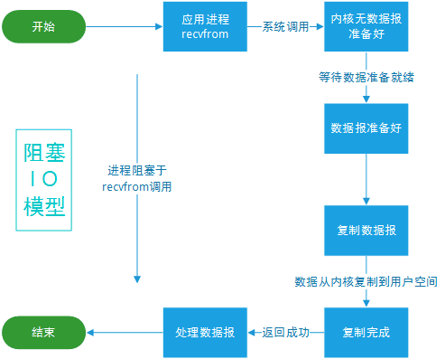
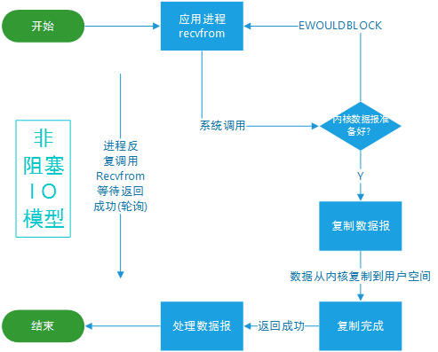

本文主要关注于java中的IO

<!--more-->

# 1. 基础


## 1.1 分类

1. 按数据的流向不同分为：**输入流和输出流**

2. 按操作数据单位的不同分为：**字节流（8bit）和字符流（16bit）**

   编码是将字符流转化为字节流，解码是将字节流转化为字节流，编码解码规则不一样会导致乱码

   字节是给计算机看的，字符是给人看的。一个字符的大小和编码方式和字符类型有关。

   java使用UTF-16be 编码，中文字符和英文字符都占 2 个字节，这样一个中文或者英文字符都可以通过一个单位char类型存放。

3. 根据IO流的角色不同分为：**节点流和处理流**

   - 节点流：直接从数据源或目的地读写数据
   - 处理流：不直接连接到数据源或目的地，而是“连接”在已存在的流（节点流或处理流）上

## 1.2 文件

文件在java中对应的对象为`File`，文件在程序中是以流的形式来操作的


```java
//常用构造方法
    //父目录以及子目录
	public File(String parent, String child) {}
	//父文件下所在目录的子目录
    private File(String child, File parent) {}
   //正常的路径
    public File(String pathname) {}
```

所有 `java.io` 中的类的**相对路径**默认都是从**用户工作目录**开始的，使用 `System.getProperty("user.dir")` 可以获取你的用户工作目录。

在 Windows 系统中的分隔符为 "`\\`"，在 Linux 系统中分隔符为 "`/`"，为了保证系统的可移植性，可以通过常量字符串 `java.io.File.separator` 获取。

```java
/**
     * @param filename 文件名
     * @param path 文件所在路径
     *
     */
    public static void createNewFile(String filename,String path){
        if(filename.isEmpty())
            return ;
        String pa = path+ File.separator+filename;
        //可以使用其他方式创建File对象
        File file = new File(pa);
        try{
            file.createNewFile();
        }catch (IOException e){
            e.printStackTrace();
        }
    }
```


| 返回值  | 方法名            | 描述             |
| ------- | ----------------- | ---------------- |
| String  | getName()         | 获取文件名       |
| String  | getAbsolutePath() | 获取文件绝对路径 |
| String  | getParent()       | 获取文件父级目录 |
| long    | length()          | 返回文件字节大小 |
| boolean | exists()          | 判断文件是否存在 |
| boolean | isFile()          | 判断是否是文件   |
| boolean | isDirectory()     | 判断是否是目录   |

| 返回值  | 方法名   | 描述           |
| ------- | -------- | -------------- |
| boolean | mkdir()  | 创建一级目录   |
| boolean | mkdirs() | 创建多级目录   |
| boolean | delete() | 删除文件或目录 |

```java
 public void tableOfContent(){
        String parentPath = System.getProperty("user.dir");
        String fileName = "testFile.txt";
        String directoryName = "a";
        String mulDirectoryName = "b/c/d";
        // 删除文件
        File file = new File(parentPath, fileName);
        file.delete();
        // 创建一级目录
        File directory = new File(parentPath, directoryName);
        directory.mkdir();
        // 创建多级目录
        File mulDirectory = new File(parentPath, mulDirectoryName);
        mulDirectory.mkdirs();
        // 删除目录
        directory.delete();
    }
```

## 1.3 输入输出流

**try-with-resources**

这个语法糖的出现主要是为了减少关闭创建资源的工作

详见https://zhuanlan.zhihu.com/p/27824934

### 1.3.1 字节流


#### InputStream系


| 返回值 | 方法                                   | 描述                                                         |
| ------ | -------------------------------------- | ------------------------------------------------------------ |
| int    | read()                                 | 返回输入流中下一个字节的数据。返回的值介于 0 到 255 之间。如果未读取任何字节，则代码返回 `-1` ，表示文件结束。 |
| int    | read(byte b[ ])                        | 从输入流中读取一些字节存储到数组 `b` 中。如果数组 `b` 的长度为零，则不读取。如果没有可用字节读取，返回 `-1`。如果有可用字节读取，则最多读取的字节数最多等于 `b.length` ，返回读取的字节数。 |
| int    | read(byte b[], int off, int len)       | 在`read(byte b[ ])` 方法的基础上增加了 `off` 参数（偏移量）和 `len` 参数（要读取的最大字节数）。 |
| long   | skip(long n)                           | 忽略输入流中的 `n` 个字节 ，返回实际忽略的字节数。           |
| int    | available()                            | 返回输入流中可以读取的字节数。                               |
| void   | close()                                | 关闭输入流释放相关的系统资源。                               |
| byte[] | readAllBytes()                         | 读取输入流中的所有字节，返回字节数组。                       |
| byte[] | readNBytes(byte[] b, int off, int len) | 阻塞直到读取 `len` 个字节。                                  |
| long   | transferTo(OutputStream out)           | 将所有字节从一个输入流传递到一个输出流。                     |

1. **FileInputStream**

   

   可以把File类实例作为参数传入构造函数，以类似以下读取数据

   ```java
    FileInputStream in = new FileInputStream(new File("文件路径"));
    byte[] buf = new byte[8]; 
    int readLen;
           // 返回值为 -1 时，表示读取完毕
           while ((readLen = in.read(buf)) != -1) {
               System.out.print(new String(buf, 0, readLen)); 
   ```

2. **FilterInputStream**

   该类是标准的装饰器模式的示例，FilterInputStream作为装饰器的根抽象类，可以接收InputStream对象实例作为参数以增强原有功能。

   - **BufferedInputStream**

     内置了缓冲，可以提升效率（尽量使用该类）

     ```java
     //再套一层就行了
     BufferedInputStream in = new BufferedInputStream(new FileInputStream(new File("文件路径")));
             byte[] buf = new byte[8];
             int readLen;
             // 返回值为 -1 时，表示读取完毕
             while ((readLen = in.read(buf)) != -1) {
                 System.out.print(new String(buf, 0, readLen));
             }
     ```

   - **DataInputStream**

     用于读取指定类型的数据

     ```java
     @Test
     public void testDataInputStream() throws IOException {
         // 必须将一个 InputStream 的实现类作为构造参数才能使用
         try(DataInputStream dis = new DataInputStream(new FileInputStream("mrpersimmon2.txt"))) {
             // 可以读取任意具体的类型数据
             System.out.println(dis.readUTF()); // 读取已使用 modified UTF-8 格式编码的字符串。
         } catch (IOException e) {
             e.printStackTrace();
         }
     }
     ```

3. **ObjectInputStream**

   该类是序列化相关的类（反序列化），也就是可以从流中读取对象


#### OutputStream系

| 返回值 | 方法名                            | 描述                                                         |
| ------ | --------------------------------- | ------------------------------------------------------------ |
| void   | write(int b)                      | 将特定字节写入输出流。                                       |
| void   | write(byte[] b)                   | 将数组 `b` 写入到输出流，等价于 `write(b, 0, b.length)` 。   |
| void   | write(byte[] b, int off, int len) | 在 `write(byte b[])` 方法的基础上增加了 `off` 参数（偏移量）和 `len` 参数（要读取的最大字节数）。 |
| void   | flush()                           | 刷新此输出流并强制写出所有缓冲的输出字节。                   |
| void   | close()                           | 关闭输出流释放相关的系统资源。                               |

OutputStream 下的子类`FileOutputStream` ，`DataOutputStream`，`ObjectOutputStream`与`InputStream`中的类似

##### PrintStream

经常使用的 `System.out` 就是用于获取一个 `PrintStream` 对象，`System.out.print` 方法实际调用的是 `PrintStream` 对象的 `write` 方法。默认情况下，`PrintStream` 输出数据的位置是标准输出，即显示器。

print(x)会先调用String.valueOf(x)将内容转换成字符串，在调用内部的write()方法。

### 1.3.2 字符流

#### Writer系

| 返回值 | 方法名                               | 描述                                                         |
| ------ | ------------------------------------ | ------------------------------------------------------------ |
| void   | write(int c)                         | 写入单个字符。                                               |
| void   | write(char[] cbuf)                   | 写入字符数组 `cbuf`，等价于`write(cbuf, 0, cbuf.length)`。   |
| void   | write(char[] cbuf, int off, int len) | 在`write(char[] cbuf)` 方法的基础上增加了 `off` 参数（偏移量）和 `len` 参数（要读取的最大字符数）。 |
| void   | write(String str)                    | 写入字符串，等价于 `write(str, 0, str.length())` 。          |
| void   | write(String str, int off, int len)  | 在`write(String str)` 方法的基础上增加了 `off` 参数（偏移量）和 `len` 参数（要读取的最大字符数）。 |
| Writer | append(CharSenquence csq)            | 将指定的字符序列附加到指定的 `Writer` 对象并返回该 `Writer` 对象。 |
| Writer | append(char c)                       | 将指定的字符附加到指定的 `Writer` 对象并返回该 `Writer` 对象. |
| void   | flush()                              | 刷新此输出流并强制写出所有缓冲的输出字符。                   |
| void   | close()                              | 关闭输出流释放相关的系统资源。                               |

 

#### Reader系

| 返回值 | 方法名                              | 描述                                                         |
| ------ | ----------------------------------- | ------------------------------------------------------------ |
| int    | read()                              | 从输入流读取一个字符。                                       |
| int    | read(char[] cbuf)                   | 从输入流中读取一些字符，并将它们存储到字符数组 `cbuf`中，等价于 `read(cbuf, 0, cbuf.length)` 。 |
| int    | read(char[] cbuf, int off, int len) | 在`read(char[] cbuf)` 方法的基础上增加了 `off` 参数（偏移量）和 `len` 参数（要读取的最大字符数）。 |
| long   | skip(long n)                        | 忽略输入流中的 n 个字符，返回实际忽略的字符数。              |
| void   | close()                             | 关闭输入流并释放相关的系统资源。                             |

### 1.3.3 OutputStreamWriter与InputStreamReader

这两个类是FileWriter/Reader的父类，主要作用是进行字符与字节之间的转化

## 1.4 综合

计算机只认字节，所以使用字节流效率要大于字符流（字符流也是通过字符与字节之间转化来实现流与文件交互的）.

IO操作很耗时，所以一次尽量操作较多数据。

## RandomAccessFile类

**支持随意跳转到文件任意位置读写**

```java
// String name: 指定名称的文件
public RandomAccessFile(String name, String mode) throws FileNotFoundException{
    this(name != null ? new File(name) : null, mode);
}
// String file: 指定文件
public RandomAccessFile(File file, String mode) throws FileNotFoundException{...}
```

| mode | 描述                                                         |
| ---- | ------------------------------------------------------------ |
| r    | 只读                                                         |
| rw   | 读写                                                         |
| rwd  | 相较于 `rw`，还要求对「文件内容」的每次更新都同步写入底层存储设备。 |
| rws  | 相较于 `rw`，还需要将对「文件内容」或「元数据」的每次更新同步写入底层存储设备； |

**常用方法**

| 返回值 | 方法                              | 描述                                                         |
| ------ | --------------------------------- | ------------------------------------------------------------ |
| long   | getFilePointer()                  | 获取文件指针当前位置                                         |
| void   | set(long pos)                     | 设置文件指针的偏移量                                         |
| long   | length()                          | 返回文件长度                                                 |
| int    | read()                            | 读取一个字节                                                 |
| int    | read(byte[] b)                    | 从该文件读取最多 `b.length`字节的数据到字节数组。            |
| int    | read(byte[] b, int off, int len)  | 从该文件读取最多 `len`个字节的数据到字节数组。               |
| String | readLine()                        | 读取下一行文本。                                             |
| String | readUTF()                         | 从该文件读取字符串。                                         |
| void   | write(byte[] b)                   | 从指定的字节数组写入 `b.length`个字节到该文件，从当前文件指针开始。 |
| void   | write(byte[] b, int off, int len) | 从指定的字节数组写入 `len`个字节，从偏移量 `off`开始写入此文件。 |
| void   | write(int b)                      | 将指定的字节写入此文件。                                     |
| void   | writeUTF(String str)              | 以机器无关的方式使用 UTF-8 编码将字符串写入文件。            |
| int    | skipBytes(int n)                  | 尝试跳过 `n `字节的输入，丢弃跳过的字节。                    |

## RandomAccessFile实现断点续传

# //todo

# 2. IO模型（Unix）

## 2.1 简述

一个输入操作通常包括两个阶段:

1. 等待数据准备好（数据已经通过读取磁盘或者通过网络模块获取到内核缓冲区中）

2. 从内核缓冲区向进程缓冲区复制数据

对于一个套接字上的输入操作，第一步通常涉及等待数据从网络中到达。当所等待分组到达时，它被复制到内核中的某个缓冲区。第二步就是把数据从内核缓冲区复制到应用进程缓冲区。

### 阻塞式IO

**在获取数据时应用进程被阻塞，直到数据到达进程缓冲区**

应该注意到，在阻塞的过程中，其它程序还可以执行，因此阻塞不意味着整个操作系统都被阻塞。因为其他程序还可以执行，因此不消耗 CPU 时间，这种模型的执行效率会比较高。

```c
ssize_t recvfrom(int sockfd, void *buf, size_t len, int flags, struct sockaddr *src_addr, socklen_t *addrlen);
```



### 非阻塞式IO

应用进程执行系统调用之后，内核返回一个错误码。应用进程可以继续执行，但是需要不断的执行系统调用来获知 I/O 是否完成，这种方式称为轮询(polling)。

由于 CPU 要处理更多的系统调用，因此这种模型是比较低效的。



### IO复用

使用 select 或者 poll 等待数据，并且可以等待多个套接字中的任何一个变为可读，这一过程会被阻塞，当某一个套接字可读时返回。之后再使用 recvfrom 把数据从内核复制到进程中。

它可以让单个进程具有处理多个 I/O 事件的能力。又被称为 Event Driven I/O，即事件驱动 I/O。

如果一个 Web 服务器没有 I/O 复用，那么每一个 Socket 连接都需要创建一个线程去处理。如果同时有几万个连接，那么就需要创建相同数量的线程。并且相比于多进程和多线程技术，I/O 复用不需要进程线程创建和切换的开销，系统开销更小。


### 信号驱动IO

应用进程使用 sigaction 系统调用，内核立即返回，应用进程可以继续执行，也就是说等待数据阶段应用进程是非阻塞的。内核在数据到达时向应用进程发送 SIGIO 信号，应用进程收到之后在信号处理程序中调用 recvfrom 将数据从内核复制到应用进程中。

相比于非阻塞式 I/O 的轮询方式，信号驱动 I/O 的 CPU 利用率更高。


### 异步IO

进行 aio_read 系统调用会立即返回，应用进程继续执行，不会被阻塞，内核会在所有操作完成之后向应用进程发送信号。

异步 I/O 与信号驱动 I/O 的区别在于，异步 I/O 的信号是通知应用进程 I/O 完成，而信号驱动 I/O 的信号是通知应用进程可以开始 I/O。


## 2.2 区别

前四种 I/O 模型的主要区别在于第一个阶段，而第二个阶段是一样的: 将数据从内核复制到应用进程过程中，应用进程会被阻塞。


## 2.3 IO多路复用

### 工作模式

1. **LT模式**（边缘触发）：

   当 epoll_wait() 检测到描述符事件到达时，将此事件通知进程，进程可以不立即处理该事件，下次调用 epoll_wait() 会再次通知进程。是默认的一种模式，并且同时支持 Blocking 和 No-Blocking。

2. **ET模式**（水平触发）：

   和 LT 模式不同的是，通知之后进程必须立即处理事件，下次再调用 epoll_wait() 时不会再得到事件到达的通知。

   很大程度上减少了 epoll 事件被重复触发的次数，因此效率要比 LT 模式高。只支持 No-Blocking，以避免由于一个文件句柄的阻塞读/阻塞写操作把处理多个文件描述符的任务饿死。

3. **select 应用场景**

   select 的 timeout 参数精度为 1ns，而 poll 和 epoll 为 1ms，因此 select 更加适用于实时要求更高的场景，比如核反应堆的控制。select 可移植性更好，几乎被所有主流平台所支持。

   **只支持LT**

   **缺点**：使用数组存文件描述符，fd_set会在用户空间和内核空间之间来回复制，监控的文件描述符数量有限

4. **poll 应用场景**

   poll 没有最大描述符数量的限制，如果平台支持并且对实时性要求不高，应该使用 poll 而不是 select。需要同时监控小于 1000 个描述符，就没有必要使用 epoll，因为这个应用场景下并不能体现 epoll 的优势。需要监控的描述符状态变化多，而且都是非常短暂的，也没有必要使用 epoll。因为 epoll 中的所有描述符都存储在内核中，造成每次需要对描述符的状态改变都需要通过 epoll_ctl() 进行系统调用，频繁系统调用降低效率。并且epoll 的描述符存储在内核，不容易调试。

   **只支持LT**

   **缺点**：使用链表存文件描述符，获得文件描述符信息还是要O(n)时间复杂度遍历链表

5. **epoll 应用场景**

   只需要运行在 Linux 平台上，并且有非常大量的描述符需要同时轮询，而且这些连接最好是长连接。

   **支持LT和ET**

   使用红黑树存文件描述符，将就绪文件描述符添加到队列中。

# 3. IO模型（java）

**同步与非同步：**这两个概念是`操作系统级别`的。主要描述的是操作系统在收到程序请求IO操作后，如果IO资源没有准备好，该如何响应程序的问题: 前者不响应，直到IO资源准备好以后；后者返回一个标记(好让程序和自己知道以后的数据往哪里通知)，当IO资源准备好以后，再用事件机制返回给程序。

**阻塞与非阻塞：**这两个概念是`程序级别`的。主要描述的是程序请求操作系统IO操作后，如果IO资源没有准备好，那么程序该如何处理的问题: 前者等待；后者继续执行(并且使用线程一直轮询，直到有IO资源准备好了)

## 3.1 BIO

传统从服务端获取连接`accept()`方法以及从从流中获取数据的`read()`都是阻塞的，这些方法的调用会导致该线程一直处于等待状态

## 3.2 NIO

#### 流和块

I/O 与 NIO 最重要的区别是数据打包和传输的方式，I/O 以流的方式处理数据，而 NIO 以块的方式处理数据。

面向流的 I/O 一次处理一个字节数据: 一个输入流产生一个字节数据，一个输出流消费一个字节数据。为流式数据创建过滤器非常容易，链接几个过滤器，以便每个过滤器只负责复杂处理机制的一部分。不利的一面是，面向流的 I/O 通常相当慢。

面向块的 I/O 一次处理一个数据块，按块处理数据比按流处理数据要快得多。但是面向块的 I/O 缺少一些面向流的 I/O 所具有的优雅性和简单性。

#### 通道与缓冲区

1. Channel（通道）

   通道 Channel 是对原 I/O 包中的流的模拟，可以通过它读取和写入数据。但是通道是双向的，不同于只能单向传输数据的InputStream或OutputStream

   **常用类**：

   - FileChannel: 从文件中读写数据；

   - DatagramChannel: 通过 UDP 读写网络中数据；

   - SocketChannel: 通过 TCP 读写网络中数据；

   - ServerSocketChannel: 可以监听新进来的 TCP 连接，对每一个新进来的连接都会创建一个 SocketChannel。

2. Buffer（缓冲区）

   使用通道交换数据时，会先经过缓冲区

   **常见类型**：

   + ByteBuffer
   + CharBuffer
   + ShortBuffer
   + IntBuffer
   + LongBuffer
   + FloatBuffer
   + DoubleBuffer

#### Buffer详细分析 

```java
//Buffer中定义的四个成员变量
public abstract class Buffer {
    // Invariants: mark <= position <= limit <= capacity
    private int mark = -1;
    private int position = 0;
    private int limit;
    private int capacity;
}
```

1. **容量（`capacity`）**：`Buffer`可以存储的最大数据量，`Buffer`创建时设置且不可改变；
2. **界限（`limit`）**：`Buffer` 中可以读/写数据的边界。写模式下，`limit` 代表最多能写入的数据，一般等于 `capacity`（可以通过`limit(int newLimit)`方法设置）；读模式下，`limit` 等于 Buffer 中实际写入的数据大小。
3. **位置（`position`）**：下一个可以被读写的数据的位置（索引）。从写操作模式到读操作模式切换的时候（flip），`position` 都会归零，这样就可以从头开始读写了。
4. **标记（`mark`）**：`Buffer`允许将位置直接定位到该标记处，这是一个可选属性；

 **两种模式**：

Buffer有写和读两种模式。Buffer创建出来默认是写模式，调用 `flip()` 可以切换到读模式。如果要再次切换回写模式，可以调用 `clear()` 或者 `compact()` 方法。


**读写模式下三个成员变量之间的关系：**


**创建方式**：

不能直接通过`new`调用构造方法创建对象，只能通过静态方法实例化`Buffer`

```java
//以ByteBuffer为例，其他缓冲区都差不多
// 分配堆内存
public static ByteBuffer allocate(int capacity);
// 分配直接内存
public static ByteBuffer allocateDirect(int capacity);
```

**常用方法**：

| 返回值    | 方法    | 描述                                                         |
| --------- | ------- | ------------------------------------------------------------ |
| xxx       | get()   | 读取缓冲区的数据                                             |
| xxxBuffer | put()   | 向缓冲区写入数据                                             |
| Buffer    | flip()  | 将缓冲区从写模式切换到读模式，它会将 `limit` 的值设置为当前 `position` 的值，将 `position` 的值设置为 0。 |
| Buffer    | clear() | 清空缓冲区，将缓冲区从读模式切换到写模式，并将 `position` 的值设置为 0，将 `limit` 的值设置为 `capacity` 的值。 |

#### 选择器

Selector（选择器） 是 NIO 中的一个关键组件，它允许一个线程处理多个 Channel。Selector 是基于事件驱动的 I/O 多路复用模型，主要运作原理是：通过 Selector 注册通道的事件，Selector 会不断地轮询注册在其上的 Channel。当事件发生时，比如：某个 Channel 上面有新的 TCP 连接接入、读和写事件，这个 Channel 就处于就绪状态，会被 Selector 轮询出来。Selector 会将相关的 Channel 加入到就绪集合中。通过 SelectionKey 可以获取就绪 Channel 的集合，然后对这些就绪的 Channel 进行响应的 I/O 操作。

**Selector可以监听的四种数据类型**：

```java
public static final int OP_READ = 1 << 0;    //表示通道准备好进行读取的事件，即有数据可读。
public static final int OP_WRITE = 1 << 2;   //表示通道准备好进行写入的事件，即可以写入数据。
public static final int OP_CONNECT = 1 << 3; //表示通道完成连接的事件，这通常用于 SocketChannel。
public static final int OP_ACCEPT = 1 << 4;  //表示通道接受连接的事件，这通常用于 ServerSocketChannel。
```

可以看出每个事件可以被当成一个位域，从而组成事件集整数。例如:

```java
int interestSet = SelectionKey.OP_READ | SelectionKey.OP_WRITE;
```

一个Selector的三个Selection：

1. 所有的 `SelectionKey` 集合：代表了注册在该 Selector 上的 `Channel`，这个集合可以通过 `keys()` 方法返回。

2. 被选择的 `SelectionKey` 集合：代表了所有可通过 `select()` 方法获取的、需要进行 `IO` 处理的 Channel，这个集合可以通过 `selectedKeys()` 返回。

3. 被取消的 `SelectionKey` 集合：代表了所有被取消注册关系的 `Channel`，在下一次执行 `select()` 方法时，这些 `Channel` 对应的 `SelectionKey` 会被彻底删除，程序通常无须直接访问该集合，也没有暴露访问的方法。

```java
//遍历选择的Channel
Set<SelectionKey> selectedKeys = selector.selectedKeys();
Iterator<SelectionKey> keyIterator = selectedKeys.iterator();
while (keyIterator.hasNext()) {
    SelectionKey key = keyIterator.next();
    if (key != null) {
        if (key.isAcceptable()) {
            // ServerSocketChannel 接收了一个新连接
        } else if (key.isConnectable()) {
            // 表示一个新连接建立
        } else if (key.isReadable()) {
            // Channel 有准备好的数据，可以读取
        } else if (key.isWritable()) {
            // Channel 有空闲的 Buffer，可以写入数据
        }
    }
    keyIterator.remove();
}
```

**`select()`相关方法**

1. `int select()`：监控所有注册的 `Channel`，当它们中间有需要处理的 `IO` 操作时，该方法返回，并将对应的 `SelectionKey` 加入被选择的 `SelectionKey` 集合中，该方法返回这些 `Channel` 的数量。

2. `int select(long timeout)`：可以设置超时时长的 `select()` 操作。

3. `int selectNow()`：执行一个立即返回的 `select()` 操作，相对于无参数的 `select()` 方法而言，该方法不会阻塞线程。

4. `Selector wakeup()`：使一个还未返回的 `select()` 方法立刻返回。

```java
//NIO实例
import java.io.IOException;
import java.net.InetSocketAddress;
import java.nio.ByteBuffer;
import java.nio.channels.SelectionKey;
import java.nio.channels.Selector;
import java.nio.channels.ServerSocketChannel;
import java.nio.channels.SocketChannel;
import java.util.Iterator;
import java.util.Set;

public class NioSelectorExample {

  public static void main(String[] args) {
    try {
      ServerSocketChannel serverSocketChannel = ServerSocketChannel.open();
      serverSocketChannel.configureBlocking(false);
      serverSocketChannel.socket().bind(new InetSocketAddress(8080));

      Selector selector = Selector.open();
      // 将 ServerSocketChannel 注册到 Selector 并监听 OP_ACCEPT 事件
      serverSocketChannel.register(selector, SelectionKey.OP_ACCEPT);

      while (true) {
        int readyChannels = selector.select();

        if (readyChannels == 0) {
          continue;
        }

        Set<SelectionKey> selectedKeys = selector.selectedKeys();
        Iterator<SelectionKey> keyIterator = selectedKeys.iterator();

        while (keyIterator.hasNext()) {
          SelectionKey key = keyIterator.next();

          if (key.isAcceptable()) {
            // 处理连接事件
            ServerSocketChannel server = (ServerSocketChannel) key.channel();
            SocketChannel client = server.accept();
            client.configureBlocking(false);

            // 将客户端通道注册到 Selector 并监听 OP_READ 事件
            client.register(selector, SelectionKey.OP_READ);
          } else if (key.isReadable()) {
            // 处理读事件
            SocketChannel client = (SocketChannel) key.channel();
            ByteBuffer buffer = ByteBuffer.allocate(1024);
            int bytesRead = client.read(buffer);

            if (bytesRead > 0) {
              buffer.flip();
              System.out.println("收到数据：" +new String(buffer.array(), 0, bytesRead));
              // 将客户端通道注册到 Selector 并监听 OP_WRITE 事件
              client.register(selector, SelectionKey.OP_WRITE);
            } else if (bytesRead < 0) {
              // 客户端断开连接
              client.close();
            }
          } else if (key.isWritable()) {
            // 处理写事件
            SocketChannel client = (SocketChannel) key.channel();
            ByteBuffer buffer = ByteBuffer.wrap("Hello, Client!".getBytes());
            client.write(buffer);
            // 将客户端通道注册到 Selector 并监听 OP_READ 事件
            client.register(selector, SelectionKey.OP_READ);
          }

          keyIterator.remove();
        }
      }
    } catch (IOException e) {
      e.printStackTrace();
    }
  }
}
```

## 3.3 零拷贝

零拷贝是指计算机执行 IO 操作时，CPU 不需要将数据从一个存储区域复制到另一个存储区域，从而可以减少上下文切换以及 CPU 的拷贝时间。也就是说，零拷贝主主要解决操作系统在处理 I/O 操作时频繁复制数据的问题。

Java 对零拷贝的支持：

+ `MappedByteBuffer` 是 NIO 基于内存映射（`mmap`）这种零拷⻉⽅式的提供的⼀种实现，底层实际是调用了 Linux 内核的 `mmap` 系统调用。它可以将一个文件或者文件的一部分映射到内存中，形成一个虚拟内存文件，这样就可以直接操作内存中的数据，而不需要通过系统调用来读写文件。
+ `FileChannel` 的`transferTo()/transferFrom()`是 NIO 基于发送文件（`sendfile`）这种零拷贝方式的提供的一种实现，底层实际是调用了 Linux 内核的 `sendfile`系统调用。它可以直接将文件数据从内核发送到网络，而不需要经过用户空间的缓冲区。

```java
private void loadFileIntoMemory(File xmlFile) throws IOException {
  FileInputStream fis = new FileInputStream(xmlFile);
  // 创建 FileChannel 对象
  FileChannel fc = fis.getChannel();
  // FileChannel.map() 将文件映射到直接内存并返回 MappedByteBuffer 对象
  MappedByteBuffer mmb = fc.map(FileChannel.MapMode.READ_ONLY, 0, fc.size());
  xmlFileBuffer = new byte[(int)fc.size()];
  mmb.get(xmlFileBuffer);
  fis.close();
}
```

向内存映射文件写入可能是危险的，只是改变数组的单个元素这样的简单操作，就可能会直接修改磁盘上的文件。修改数据与将数据保存到磁盘是没有分开的。

## 3.4 AIO

异步IO，Linux没有这种机制的支持，只能模拟AIO，使用效率提升不大。

## 3.5 Reactor模型

我们可以粗略的将网络IO过程分为以下几个部分

1. 连接的建立
2. 数据的接受
3. 数据的处理（数据的编解码以及业务计算）
4. 数据的发送

### 传统IO模型


一个线程处理一个客户端请求的全过程。由于一次请求的部分过程是不需要消耗CPU资源的（时间占比可能还挺大），所以一个线程处理一个请求的方式效率不高。

### 事件驱动模型


Reactor部分分为mainReactor与subReactor

1. **mainReactor**

   mainReactor主要进行客户端连接的处理，处理完成之后将该连接交由subReactor以处理客户端的网络读写。

2. **subReactor**

   subReactor使用一个线程池作为支撑，用多线程来处理网络读写和数据处理

Reactor是根据`java.nio`包中的api提出的一套IO模型

