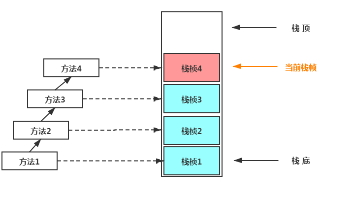

# 1. 垃圾回收

## 1.1 基础

### 垃圾的定义

没有任何引用指向的一个对象或者多个对象（循环引用）

### 垃圾定位

1. 引用计数（ReferenceCount）

   加一个引用计数器+1，减少一个计数器-1（易出现循环引用的问题）

2. 根可达算法(RootSearching)

   常见根：

   - JVM statck 虚拟机栈
   - native method statck 本地方法栈
   - run-time constant pool 常量池
   - static references in method area 方法区的静态引用 
   - Clazz 

### GC算法

1. 标记清除(mark sweep) - 位置不连续 产生碎片 效率偏低（两遍扫描）

   

   碎片空间可能导致大对象没有地方存放

2. 拷贝算法 (copying) - 没有碎片，浪费空间

   

   将空间分成两半，gc时将使用一半的存活对象复制到另一半

3. 标记压缩(mark compact) - 没有碎片，效率偏低（两遍扫描，指针需要调整）

   

   

## 1.2 JVM内存分代模型

1. 部分垃圾回收器使用的模型

   > 除Epsilon ZGC Shenandoah之外的GC都是使用逻辑分代模型
   >
   > G1是逻辑分代，物理不分代
   >
   > 除此之外不仅逻辑分代，而且物理分代

2. 新生代 + 老年代 + 永久代（1.7）Perm Generation/ 元数据区(1.8) Metaspace

   1. 永久代 元数据 - Class
   2. 永久代必须指定大小限制 ，元数据可以设置，也可以不设置，无上限（受限于物理内存）
   3. 字符串常量 1.7 - 永久代，1.8 - 堆
   4. MethodArea逻辑概念 - 永久代、元数据

3. 新生代 = Eden + 2个suvivor区 

   1. YGC回收之后，大多数的对象会被回收，活着的进入s0
   2. 再次YGC，活着的对象eden + s0 -> s1
   3. 再次YGC，eden + s1 -> s0
   4. 年龄足够 -> 老年代 （15 CMS 6）
   5. s区装不下 -> 老年代

4. 老年代

   1. 顽固分子
   2. 老年代满了FGC Full GC

5. GC Tuning (Generation)

   1. 尽量减少FGC
   2. MinorGC = YGC
   3. MajorGC+MinorGC = FGC

## 1.3 GC常见评估指标

1. **吞吐量**：吞吐量 = 运行用户代码时间 /（运行用户代码时间 + 垃圾收集时间）。
2. **暂停时间**：执行一次垃圾回收STW时间的大小

**两者不可兼得**

如果选择以吞吐量优先，那么必然需要降低内存回收的执行频率，但是这样会导致GC需要更长的暂停时间来执行内存回收。相反的，如果选择以低延迟优先为原则，那么为了降低每次执行内存回收时的暂停时间，也只能频繁地执行内存回收，但这又引起了年轻代内存的缩减和导致程序吞吐量的下降。

## 1.4 垃圾回收器

常见垃圾回收器及其组合（远古图片，现在还有一个不是分代模型的ZGC）


## 1.5 垃圾回收器及其算法

Serial是**单线程**使用**标记复制算法**的垃圾回收器作用于**新生代**

SerialOld是**单线程**使用**标记整理算法**的垃圾回收器作用于**老年代**

ParNew是**多线程**使用**标记复制算法**的垃圾回收器作用于**新生代**


ParallelScavenge是**吞吐量优先**使用**标记复制算法**的垃圾回收器作用于**新生代**（吞吐量优先垃圾回收器），不支持**多线程**

ParallelOld是**多线程**使用**标记整理算法**的垃圾回收器作用于**老年代**

CMS是**低停顿**使用**标记清除+标记整理**算法的垃圾回收器作用于**老年代**


G1是新一代不分区的垃圾回收器之一，使用**标记复制**算法，作用于**年轻代和老年代**，兼顾**低停顿和高吞吐量**，优先回收高价值的垃圾。

**ZGC**：是一款**基于Region内存布局**的，（暂时）不设分代的，使用了读屏障、染色指针和内存多重映射等技术来实现可并发的标记-压缩算法的，以低延迟为首要目标的一款垃圾收集器。

ZGC的工作过程可以分为4个阶段：**并发标记-并发预备重分配-并发重分配-并发重映射**等。

ZGC几乎在所有地方并发执行的，除了**初始标记的是STW**的。所以停顿时间几乎就耗费在初始标记上，这部分的实际时间是非常少的。

1.8 默认是ParallelScavenge+ParallelOld。

1.9+默认是G1。

### 三色标记法

**三色**

- **白色**：还没有遍历对象
- **灰色**：已遍历到的对象，但是它直接引用的对象还没有遍历完
- **黑色**：已遍历到的对象，它的直接引用也已遍历完

**浮动垃圾**：灰色对象可能已经是垃圾了，但是还是当成正常对象存活到下一轮GC

**三色标记法黑色被误认为白色**：

1. 赋值器插入一条或多条从黑色对象到白色对象的新引用
2. 赋值器删除了全部从灰色对象到该白色对象的直接或间接引用

**两种解决方式**：

1. **增量更新法**：

   对于这种漏标的情况，CMS垃圾收集器使用的是增量更新法，就是将引用变化后的引用情况进行记录，然后之后进行标记。也就是当E->G变成了E->null,D->G，会对D->G进行记录，用于在重新标记阶段对这种情况进行处理。

2. **原始快照法**：

   就是对于这种E->G，然后改成D->G，正常来说，应该可能会漏掉，因为D已经是黑色对象了，就不会遍历G了，G1垃圾收集器对这种情况的处理是保存原始快照，就是在并发标记过程中，引用的变动，都会对变动前的引用情况进行记录，会按照变动前的引用情况进行标记，也就是即便E->G变成了E->null,D->G变化了，还是会记录E->G的引用情况，用于在重新标记阶段对这种情况进行处理。

### CMS（标记清除灰导致内存碎片化）

#### 1. 初始标记

在这个阶段中，程序中所有的工作线程都将会因为“Stop-the-World”机制而出现短暂的暂停，这个阶段的主要任务仅仅只是标记出GC Roots能直接关联到的对象。一旦标记完成之后就会恢复之前被暂停的所有应用线程。由于直接关联对象比较小，所以这里的速度非常快。

#### 2. 并发标记

从GC Roots的直接关联对象开始遍历整个对象图的过程，这个过程耗时较长但是不需要停顿用户线程，可以与垃圾收集线程一起并发运行。

#### 3. 重新标记

由于在并发标记阶段中，程序的工作线程会和垃圾收集线程同时运行或者交叉运行，因此为了修正并发标记期间，因用户程序继续运作而导致标记产生变动的那一部分对象的标记记录（比如：由不可达变为可达对象的数据），这个阶段的停顿时间通常会比初始标记阶段稍长一些，但也远比并发标记阶段的时间短。

#### 4. 并发清除

阶段清理删除掉标记阶段判断的已经死亡的对象，释放内存空间。由于不需要移动存活对象，所以这个阶段也是可以与用户线程同时并发的。


# 2. Class文件结构

Class文件为二进制，可以用powershell命令

```shell
Format-Hex D:\java\learn\out\production\learn\mix\Main.class
```

以16进制查看文件


文件的大致结构为（u2表示两个字节的无符号数)


## 2.1 魔数(magic number)

开头四个字节'CA FE BA BE' 为称为魔数，魔数是固定的，用来指定这个文件是Class文件

## 2.2 Class文件版本

四个字节，前两个为副版本，后两个为主版本。如00 00 00 3A表示Class文件版本为 58.0 (也就是java 14)

## 2.3 常量池

两个字节表示常量池的大小00 14表示常量池大小为20。由于常量池index从1开始，所以常量数量只有19个

常量的第一个字节表示常量类型，每个常量类型有不同的长度

常量池是class文件最重要的一部分，名称、类型等具体内容都会被存储在常量池中，在后续修饰字段、方法时只需要记录位置，根据位置就可以获取到具体的属性。

**常见常量类型：**


## 2.4 访问标志

之后两个字节表示访问标志


## 2.5 类索引、父类索引、接口索引集合

    u2             this_class;//当前类
    u2             super_class;//父类
    u2             interfaces_count;//接口数量
    u2             interfaces[interfaces_count];//一个类可以实现多个接口

## 2.6 字段表集合


**descriptor_index**用来描述类型

## 2.6 方法表集合


## 2.7 属性表

详见《深入理解java虚拟机》

# 3. java类加载器

## 3.1 类加载


### 加载

装载阶段，简言之，查找并加载类的二进制数据，生成Class的实例，即类模版对象。
在加载类时，Java虚拟机必须完成以下3件事情：

- 通过类的全名，获取类的二进制数据流。
- 解析类的二进制数据流为方法区内的数据结构（Java类模型）
- 创建java.lang.Class类的实例，表示该类型。作为方法区这个类的各种数据的访问入口

**类模板对象**
所谓类模板对象，其实就是Java类在JVM内存中的一个快照，JVM将从字节码文件中解析出的常量池、类字段、类方法等信息存储到类模板中，这样JVM在运行期便能通过类模板而获取Java类中的任意信息，能够对Java类的成员变量进行遍历，也能进行Java方法的调用。

反射的机制即基于这一基础。如果JVM没有将Java类的声明信息存储起来，则JVM在运行期也无法反射。

**类模型的位置**
加载的类在JVM中创建相应的类结构，类结构会存储在方法区(JDK1.8之前：永久代；JDK1.8及之后：元空间)。

**数组类的加载**

创建数组类的情况稍微有些特殊，因为数组类本身并不是由类加载器负责创建，而是由JVM在运行时根据需要而直接创建的，但数组的元素类型仍然需要依靠类加载器去创建。

### 链接

1. 验证

   **目的：**保证加载的字节码是合法、合理并符合规范的

   

   其中格式验证会和装载阶段一起执行。验证通过之后，类加载器才会成功将类的二进制数据信息加载到方法区中。
   格式验证之外的验证操作将会在方法区中进行。（其他验证略）

2. 准备

   简言之，为类的静态变量分配内存，并将其初始化为默认值。
   在这个阶段，虚拟机就会为这个类分配相应的内存空间，并设置默认初始值。Java虚拟机为各类型变量默认的初始值如表所示。

   

   注意：Java并不支持boolean类型，对于boolean类型，内部实现是int,由于int的默认值是0,故对应的，boolean的默认值就是false。

3. 解析

   将类、接口、字段和方法的符号引用转为直接引用。

   如`System.out.println();`转换过程

   

   Java虚拟机规范并没有明确要求解析阶段一定要按照顺序执行。在HotSpot VM中，加载、验证、准备和初始化会按照顺序有条不紊地执行，但链接阶段中的解析操作往往会伴随着JVM在执行完初始化之后再执行。

### 初始化

调用<clinit>初始化方法，

```java
public class InitializationTest1 {
    //场景1：对于非静态的字段，不管是否进行了显式赋值，都不会生成<clinit>()方法
    public int num = 1;
    //场景2：静态的字段，没有显式的赋值，不会生成<clinit>()方法
    public static int num1;
    //场景3：比如对于声明为static final的基本数据类型的字段，不管是否进行了显式赋值，都不会生成<clinit>()方法
    public static final int num2 = 1;
}
```

**类的初始化时机**

1. 当创建一个类的实例时，比如使用new关键字，或者通过反射、克隆、反序列化。
2. 当调用类的静态方法时，即当使用了字节码invokestatic指令。
3. 当使用类、接口的静态字段时(final修饰特殊考虑)，比如，使用getstatic或者putstatic指令。
4. 当使用java.lang.reflect包中的方法反射类的方法时。比如：Class.forName("com.atguigu.java.Test")
5. 当初始化子类时，如果发现其父类还没有进行过初始化，则需要先触发其父类的初始化。
6. 如果一个接口定义了default方法，那么直接实现或者间接实现该接口的类的初始化，该接口要在其之前被初始化。
7. 当虚拟机启动时，用户需要指定一个要执行的主类（包含main()方法的那个类），虚拟机会先初始化这个主类。

### 卸载

类的垃圾回收过程

## 3.2 双亲委派机制

作用：

1. 防止类库中的类被重写
2. 避免类被重复加载


Bootstrap加载`%JAVA_HOME%lib`下的jar包和class文件，ExtClassLoader加载`%JAVA_HOME%lib/lib/ext`文件夹下的jar包和class类。AppClassLoader负责加载`classpath`下的类文件。系统类加载器，线程上下文加载器贯穿三个类加载器。

3个关键方法loadClass()、findClass()、defineClass()

loadClass双亲委派模型具体的实现

findClass从指定路径中加载Class字节流

defineClass将Class字节流翻译为Class对象

## 3.3 自定义类加载器

重写loadClass()方法或者重写findClass()方法

```java
//重写findClass()方法, 遵循双亲委派模型, 子类先委托父类加载需要的类，父类从指定的路径加载类, 没有则交给子类加载
public class MyClassLoader extends ClassLoader{
    private final String classPath;
    private final String className;


    public MyClassLoader(String classPath, String className) {
        this.classPath = classPath;
        this.className = className;
    }
    @Override
    protected Class<?> findClass(String name) throws ClassNotFoundException {
        byte[] data = getData();
        if (data != null) {
            return defineClass(className,data,0,data.length);
        }
        return null;
    }

    private byte[] getData(){
        String path = classPath;
        try {
            FileInputStream inputStream = new FileInputStream(path);
            ByteArrayOutputStream byteArrayOutputStream = new ByteArrayOutputStream();
            byte[] bytes = new byte[2048];
            int num = 0;
            while ((num = inputStream.read(bytes)) != -1){
                byteArrayOutputStream.write(bytes, 0,num);
            }
            return byteArrayOutputStream.toByteArray();
        } catch (Exception e) {
            e.printStackTrace();
        }
        return null;
    }
}
```

loadClass()方法

```java
protected Class<?> loadClass(String name, boolean resolve)
        throws ClassNotFoundException
    {
        synchronized (getClassLoadingLock(name)) {
            // First, check if the class has already been loaded
            Class<?> c = findLoadedClass(name);
            if (c == null) {
                long t0 = System.nanoTime();
                try {
                    if (parent != null) {
                        c = parent.loadClass(name, false);
                    } else {
                        c = findBootstrapClassOrNull(name);
                    }
                } catch (ClassNotFoundException e) {
                    // ClassNotFoundException thrown if class not found
                    // from the non-null parent class loader
                }

                if (c == null) {
                    // If still not found, then invoke findClass in order
                    // to find the class.
                    long t1 = System.nanoTime();
                    c = findClass(name);

                    // this is the defining class loader; record the stats
                    PerfCounter.getParentDelegationTime().addTime(t1 - t0);
                    PerfCounter.getFindClassTime().addElapsedTimeFrom(t1);
                    PerfCounter.getFindClasses().increment();
                }
            }
            if (resolve) {
                resolveClass(c);
            }
            return c;
        }
    }
```


### 打破双亲委派机制

双亲委派模型

1. tomcat中部署多个应用时可能需要加载相同的类多次，双亲委派模型无法实现

   

   - 放置在/common目录中。类库可被Tomcat和所有的Web应用程序共同使用。

   - 放置在/server目录中。类库可被Tomcat使用，对所有的Web应用程序都不可见。

   - 放置在/shared目录中。类库可被所有的Web应用程序共同使用，但对Tomcat自己不可见。

   - 放置在/WebApp/WEB-INF目录中。类库仅仅可以被该Web应用程序使用，对Tomcat和其他Web应用

     

2. java中比较出名的SPI机制（线程上下文类加载器）

   父ClassLoader可以使用当前线程Thread.currentThread().getContextClassLoader()所指定的Classloader加载的类。这就改变了父ClassLoader不能使用子ClassLoader或是其他没有直接父子关系的classLoader加载的类的情况，即**改变了双亲委托模型**。

   线程上下文类加载器就是当前线程的当前类加载器(Current Classloader)。

   **在双亲委托模型下**，类加载是由下至上的，即下层的类加载器会委托上层进行加载。但是对于SPI来说，有些接口是Java核心库所提供的,而Java核心库是由启动类加载器来加载的，而这些接口的实现却来自于不同的jar包(厂商提供)， Java的启动类加载器是不会加载其他来源的jar包，这样传统的双亲委托模型就**无法满足**SPI的要求。而通过给当前线程设置上下文类加载器，就可以由设置的上下文类加载器来实现对于接口实现类的加载。

3. web应用热替换的实现（对程序动态性的最求）

   

### 沙箱安全机制

对代码的权限进行校验，判断其是否有权限操作资源

**基本组件**

- **字节码校验器**：确保lava类文件遵循lava语言规范。这样可以帮助Java程序实现内存保护。但并不是所有的类文件都会经过字节码校验，比如核心类。
- **类加载器**：防止恶意代码去干涉善意的代码，比如：双亲委派机制；守护了被信任的类库边界；将代码归入保护域，确定了代码的权限范围可以进行哪些资源操作
- **存取控制器**：存取控制器可以控制核心API对操作系统的存取权限，用户可以设定控制策略。
- **安全管理器**：安全管理器主要是核心API和操作系统之间的主要接口。比如实现权限控制，比存取控制器优先级高。
- **安全软件包**：java.security下的类和扩展包下的类，允许用户为应用增加所需要安全特性：安全提供者、消息摘要、数字签名keytools、加密、鉴别。

# 4. jvm内存模型


## 4.1 程序计数器

**作用**：记录当前线程的执行地址（记录字节码执行到哪了）

没有规定任何OutOtMemoryError情况的区域

## 4.2 栈

虚拟栈和本地方法栈的区别在于，虚拟机栈执行的是java中的方法，本地方法栈中执行的是本地接口实现的方法，其内部结构差不多

**栈的内部结构**：


**可能抛出的异常：**

- 如果采用固定大小的Java虚拟机栈，那每一个线程的Java虚拟机栈容量可以在线程创建的时候独立选定。如果线程请求分配的栈容量超过Java虚拟机栈允许的最大容量，Java虚拟机将会抛出一个 StackOverflowError 异常。
- 如果Java虚拟机栈可以动态扩展，并且在尝试扩展的时候无法申请到足够的内存，或者在创建新的线程时没有足够的内存去创建对应的虚拟机栈，那Java虚拟机将会抛出—个 OutOfMemoryError 异常。

### 栈帧

一个方法对应一个栈帧



Java方法有两种返回函数的方式，会导致栈帧被弹出

1. 正常的函数返回，使用return指令；

2. 抛出异常。

### 局部变量表

- 局部变量表，最基本的存储单元是Slot（变量槽）
- 在局部变量表里，32位以内的类型只占用一个slot（包括returnAddress类型），64位的类型（long和double)占用两个slot。
  byte 、short 、char 在存储前被转换为int，boolean 也被转换为int，0 表示false ，非0 表示true。
  long 和double 则占据两个Slot。
- JVM会为局部变量表中的每一个Slot都分配一个访问索引，通过这个索引即可成功访问到局部变量表中指定的局部变量值
- 当一个实例方法被调用的时候，它的方法参数和方法体内部定义的局部变量将会按照顺序被复制到局部变量表中的每一个Slot上
- 如果需要访问局部变量表中一个64bit的局部变量值时，只需要使用前一个索引即可。(比如：访问long或double类型变量）
- 如果当前帧是由构造方法或者实例方法创建的，那么该对象引用this将会存放在index为0的slot处，其余的参数按照参数表顺序继续排列。

局部变量超出作用域，其原本的slot将被重复利用

### 操作数栈

进行具体方法操作的初步逻辑，保存计算的中间结果

一个栈深度为32bit，为一个slot（槽位）,long、double类型数据可能占两个槽位

数据超过作用域后，所占槽位可以复用。

**栈顶缓存技术：**

基于栈式架构的虚拟机所使用的零地址指令更加紧凑，但完成一项操作的时候必然需要使用更多的入栈和出栈指令，这同时也就意味着将需要更多的指令分派（instruction dispatch）次数和内存读/写次数。

由于操作数是存储在内存中的，因此频繁地执行内存读/写操作必然会影响执行速度。为了解决这个问题，HotSpot JVM的设计者们提出了栈顶缓存（ToS，Top-of-Stack Cashing）技术，将栈顶元素全部缓存在物理CPU的寄存器中，以此降低对内存的读/写次数，提升执行引擎的执行效率。

## 4.3 堆


按照分代模型，堆可分为年轻代、老年代，年轻代可分为Eden区、s0、s1区。默认比例为`Eden:s0:s1:Old = 8:1:1:20`

**GC过程**

1. YGC回收之后，大多数的对象会被回收，活着的进入s0
2. 再次YGC，活着的对象eden + s0 -> s1
3. 再次YGC，eden + s1 -> s0
4. 年龄足够 -> 老年代 （15 CMS 6）
5. s区装不下 -> 老年代

在jdk1.7及之前会有一个堆中会有永久代的这个概念，不过永久代并不是垃圾回收的主要作用地。它主要是用来存放java中类的元数据（即java中成员变量的类型、作用范围等）所以一般把永久代称为方法区

## 4.4 方法区（元空间）

**存放内容：**

1. 类型信息
2. 域信息
3. 方法信息
4. static类变量（非final）

**运行时常量池**

作用：缩小字节码文件（存放指向常量池的应用而非直接的数据）

内容：

- 数量值
- 字符串值
- 类引用
- 字段引用
- 方法引用

## 4.5 直接内存

不是JVM定义的内存区域，直接向系统申请的内存，读写性能较高


## 4.6 StringTable

jdk1.7时移到堆中，因为方法区的内存回收效率较低

使用数组+链表实现

# 5. 四种引用

1. 强引用：就是普通的变量对对象的引用，强引用的对象不会被系统回收。
2. 软引用：当内存空间足够时，软引用的对象不会被系统回收。当内存空间不足时，软引用的对象可能被 系统回收。通常用于内存敏感的程序中。在JDK 1.2版之后提供了SoftReference类来实现软引用。
3. 弱引用：引用级别比软引用低，对于只有软引用的对象，不管内存是否足够， 都可能会被系统回收。在JDK 1.2版之后提供了WeakReference类来实现弱引用。
4. 虚引用：虚引用主要用于跟踪对象被垃圾回收的状态，在垃圾回收时可以收到一个通知。。在JDK 1.2版之后提供了PhantomReference类来实现虚引用。

# 6. jvm指令及重排

## i++与++i

```java
 public static void main(String[] args) {
        int x = 5;
        int y = 0;
        y=x++;
        y=++x;
    }

//字节码:
 0 iconst_5 	//定义常数5到操作数栈
 1 istore_1		//将操作数栈顶数存到局部变量表第二个位置
 2 iconst_0
 3 istore_2
 4 iload_1		//将局部变量表2号位load到操作数栈中
 5 iinc 1 by 1	//对局部变量表2号位加1
 8 istore_2
     
 9 iinc 1 by 1	
12 iload_1
13 istore_2
14 return
//区别在于先加1，还是先把数据load到局部变量表中
```

按用途分为9类：

1. 加载与存储指令

   ```jvm
    xload_<n> (x为i、l、f、d、a，n为 0 到 3)
    xload (x为i、l、f、d、a) 
   ```

   - i代表对int类型的数据操作
   - l代表long类型的数据操作
   - s代表short类型的数据操作
   - b代表byte类型的数据操作
   - c代表char类型的数据操作
   - f代表float类型的数据操作
   - d代表double类型的数据操作

2. 算术指令

3. 类型转换指令

4. 对象的创建与访问指令

5. 方法调用与返回指令

6. 操作数栈管理指令

7. 控制转移指令

8. 异常处理指令

9. 同步控制指令

**指令重排主要是为了最大化的利用CPU资源**

1. **编译器重排序**
2. **指令集并行的重排序**
3. **内存重排序**

指令重排的原则（as - if - serial），不过多线程环境较复杂，编译器和指令优化无法识别数据依赖性，可能出现预料之外的错误。

```java
//输出结果可能为0
private static int value;
     private static boolean flag;
	//线程1执行
     public static  void  init(){
         value=8;     //语句1
         flag=true;  //语句2
     }
	//线程2执行
     public static void getValue(){
         if(flag){
             System.out.println(value);
         }
     }
```

**解决指令重排引起的问题**（内存屏障）

不同的CPU架构和操作系统都有各自对应的内存屏障指令，java为了简化这些杂乱的场景，自己封装了一套规范——java内存模型（JMM）。java中可以通过`Volatile`、`synchronized`、`final`来避免重排序而引起的错误。


# 7. 常用参数

JDK17 和 JDK8 部分参数有变化

## 输出信息

jdk17 使用 -Xlog:gc:<file>来输出相关日志

**输出GC信息**:-XX:+PrintGCDetails

**输出GC信息**：-XX:+PrintGC

**输出GC日志到文件中：**-Xloggc:<file>

## 栈相关

**栈内存大小：**-Xss size (即：-XX:ThreadStackSize)，栈内存越大，可创建线程数量就越少

### **堆相关**：

**新生代和老年代比例：** -XX:NewRatio = 2 (default 即 1：2)

**Eden和s区比例：**-XX:SurvivorRatio=8（8:1:1）

**设置堆空间的初始内存大小**：-Xms

**设置堆空间的最大内存大小**：-Xmx

## 命令行指令

使用命令行指令：jinfo –flag 相关垃圾回收器参数 进程ID

##  垃圾收集器设置

 **XX:+UseSerialGC**   		新生代用Serial GC，且老年代用Serial Old GC

**-XX:+UseParNewGC** 	年轻代使用ParNew收集器，老年代不受影响

**-XX:ParallelGCThreads** 	限制线程数量，默认开启和CPU数据相同的线程数。

**G1**：


