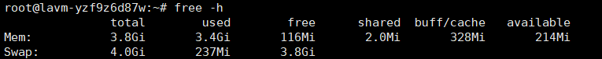

云服务器内存不足导致崩溃记录。

<!--more-->

1. **问题出现**

   之前将ES和canal相关服务跑在2c4g的京东云云服务器上，今天xshell连接查看时执行命令突然就卡住了，访问kibana也无响应，原本以为只是偶然发生，但是再我重启服务器后继续时又崩溃了。

2. **排查原因**

   想到服务器跑着ES，第一时间我就去看了下内存，果然内存严重不足，云服务器监控面板的内存监控已经显示不出数据了。重启后第一时间就执行`free -h`观察内存使用情况，发现空闲内存不足100M，且没有swap交换区。那这时问题就变得简单起来了，加个swap交换区就行了（防崩溃手段，不过磁盘io会严重影响性能，线上场景一般考虑ES分片逐步迁移数据）。

3. **解决**

   1. 禁用现有swap分区

      ```bash
      sudo swapoff -a
      ```

   2. 创建swap文件

      ```bash
      sudo dd if=/dev/zero of=/swapfile bs=1M count=2048
      ```

      - `sudo`：使用超级用户权限运行命令，以确保能够创建swap文件和更改系统设置。

      - `dd`：一个Linux命令，用于按字节复制数据，可以用来创建、备份文件或分区。这里用来创建swap文件。

      - `if=/dev/zero`：指定输入文件（`if` = input file）。`/dev/zero` 是一个虚拟文件，能够不断地生成空字节（0），所以这里可以将`/dev/zero`理解为一个数据源，提供连续的空字节数据来填充文件。

      - `of=/swapfile`：指定输出文件（`of` = output file）。这里是将生成的数据写入到`/swapfile`，也就是我们将要创建的swap文件。

      - `bs=1M`：指定每次写入的“块大小”（block size）为1MB。`dd`命令会每次从`/dev/zero`中读取1MB的数据，然后写入到`/swapfile`中。

      - `count=2048`：指定要写入多少个“块”。`count=2048`表示写入2048个1MB的块。这样，文件的总大小就是 `1M * 2048 = 2048MB`，也就是2GB。

      **swap大小设置**：

      - 4G以内的物理内存，SWAP 设置为内存的2倍。
      - 4-8G的物理内存，SWAP 等于内存大小。
      - 8-64G 的物理内存，SWAP 设置为8G。
      - 64-256G物理内存，SWAP 设置为16G。

      实际上，系统中交换分区的大小并不取决于物理内存的量，而是取决于系统中内存的负荷，所以在安装系统时要根据具体的业务来设置SWAP的值。一般Linux桌面系统的SWAP设置的会相对大一点，而Linux服务器，特别是生产环境，SWAP可能只有一点点，1-2G，很多甚至都没有SWAP（swap使用时会影响性能，具体原因自行查阅）。

   3. 配置swap文件权限

      ```bash
      #只有root有权限访问
      sudo chmod 600 /swapfile
      ```

   4. 将文件格式化为swap格式

      ```bash
      sudo mkswap /swapfile
      ```

   5. 启用新的swap文件

      ```bash
      sudo swapon /swapfile
      ```

   6. 设置开机自动挂载

      为了在服务器重启时自动启用swap，可以将该swap文件添加到`/etc/fstab`中：

      ```bash
      echo '/swapfile none swap sw 0 0' | sudo tee -a /etc/fstab
      ```

   7. 调整swappiness值

      `swappiness`控制内存使用的策略。可以通过设置`swappiness`值来控制swap的使用情况：

      ```bash
      sudo sysctl vm.swappiness=10
      #保存到配置文件中
      echo 'vm.swappiness=10' | sudo tee -a /etc/sysctl.conf
      ```

      **`swappiness` 的取值范围**

      + `swappiness` 的取值范围是 **0-100**，表示系统在物理内存与swap之间的平衡。
      + 取值越低，表示系统更倾向于优先使用物理内存，尽可能减少对swap的依赖。
      + 取值越高，表示系统更早地开始使用swap，即使物理内存还没有完全用完。

       **常用的 `swappiness` 设置**

      + **0**：表示除非物理内存完全用完，否则不会使用swap。可以将swappiness设置为0的系统几乎不使用swap，更加依赖物理内存，适合对延迟敏感的服务（如数据库）。
      + **10-20**：常用于服务器，表示只有在物理内存接近用尽时才会使用swap，这样可以降低硬盘I/O、保持系统响应速度。
      + **60**（默认值）：Linux系统的默认值，意味着内存和swap使用会相对均衡。即使内存充足，系统也会在某些情况下使用swap。
      + **100**：表示系统会尽可能频繁地使用swap，即使物理内存还充足。这种设置很少使用，因为会导致不必要的硬盘I/O并影响性能。

   执行`free -h`查看内存情况

   

   
