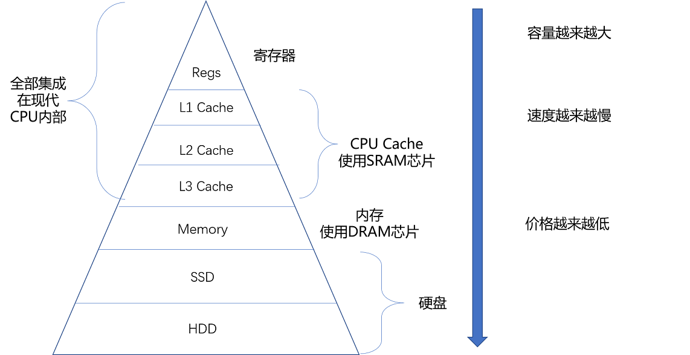
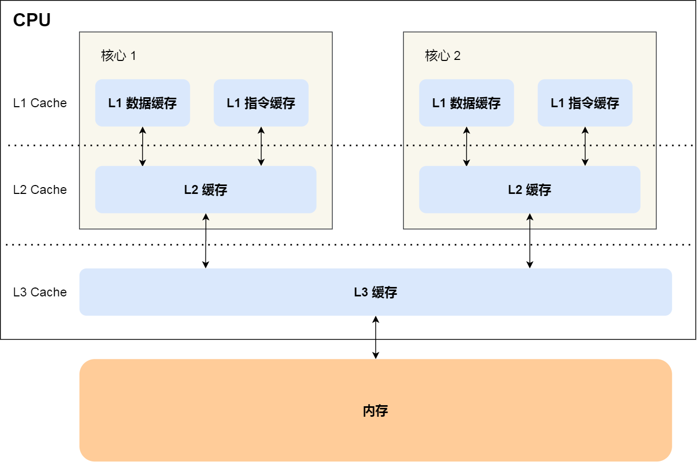
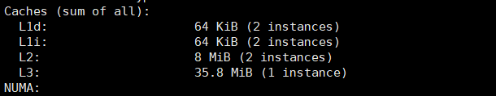
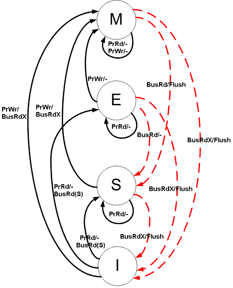

- CPU缓存架构
- 缓存一致性之MESI
- 伪共享问题

<!--more-->

# 1. Cpu缓存架构

计算机存储有着这么一条规律：越靠近CPU的空间访问速度越快，价格也越昂贵。依照这条规律，为了权衡速度与价格，CPU采用金字塔结构的多级缓存。

从[binarylei的博客](https://www.cnblogs.com/binarylei/p/12588928.html) 扒下来的图



​	现代多核CPU缓存结构图如下：

[小林coding扒下来的图](https://xiaolincoding.com/os/1_hardware/cpu_mesi.html#cpu-cache-%E7%9A%84%E6%95%B0%E6%8D%AE%E5%86%99%E5%85%A5)



L1和L2缓存是不同核心之间隔离开的，每个CPU核心都有自己L1和L2缓存。

linux执行`lscpu`查看cpu详细，这我的2c4g腾讯云服务器的缓存情况：



**L1 数据缓存 (L1d)**：总共 64 KiB，共有 2 个实例（每个核心有自己的 L1d 缓存）。

**L1 指令缓存 (L1i)**：总共 64 KiB，共有 2 个实例（每个核心有自己的 L1i 缓存）。

**L2 缓存**：总共 8 MiB，共有 2 个实例（通常是每对物理核心共享一个 L2 缓存）。

**L3 缓存**：总共 35.8 MiB，共有 1 个实例（通常是所有核心共享一个 L3 缓存）。

（KiB = 1024 B 为了与 KB = 1000 B区分）

Cpu缓存是由多个缓存行组成的，缓存行时CPU缓存变化的基本单位（`getconf LEVEL1_DCACHE_LINESIZE`查看缓存行大小：64B），cache line由`tag标记`和`data block`数据块组成。

- `data block`存放数据
- `tag`作用下面细说

# 2. 缓存一致性

## 2.1 mesi协议

### 2.1.1 多级缓存的问题

CPU为了提升效率，在写数据时先考虑将数据写入cache line，让缓存需要被替换下去时才会将cache line数据更新到内存中。

单核环境下，这种先写缓存的方式没有什么问题，但是多核环境下同时操作数据就会导致线程安全问题，要保证不同核心**缓存的一致性**需要两点：

- **写传播**：某个CPU核心中的cache更新时，需要把这种状态传播给其他核心的cache
- **串行化**：写传播被每个CPU核心接受的顺序需要保持一致。例：写传播消息为 **i = 100**和 **i = 200**，每个核心都必须先接收到**i = 100** 然后再接受 **i = 200** 。

### 2.1.2 解决

#### 总线嗅探

解决缓存一致性问题，只要让每个CPU通过生产消费的方式互相感知就行了。首先CPU每个核心都去监听总线上的信息，充当消费者的角色，当一个CPU核心写了缓存数据时**广播**事件到总线上。

**问题**：

1. 没有解决上述问题中的串行化
2. CPU每个核心上的数据不一定冲突，但是在数据变更时，CPU都会发出广播事件**加重总线负担**。

#### MESI协议

MESI协议基于总线嗅探实现了缓存一致性的解决方案，MESI四个字母表示的是cache line的四个状态（上边的tag这里就需要用到了）。

**状态解释**：

1. **Modified（已修改）**：

   - 在此状态下，缓存行在当前核心中是已修改的，且与主存中的数据不一致。

   - 当前核心是该缓存行的唯一拥有者，其他核心的缓存中没有此数据。

   - 如果其他核心请求该缓存行，当前核心需要将数据写回主存并将缓存行的状态转为 **Shared** 或 **Invalid**。

2. **Exclusive（独占）**：

   + 在此状态下，缓存行在当前核心中与主存一致，且没有其他核心持有该缓存行。
   + 当当前核心修改该缓存行时，状态转为 **Modified**。
   + 如果其他核心请求该缓存行，当前核心将其状态改为 **Shared**，并允许其他核心访问。

3. **Shared（共享）**：

   + 在此状态下，缓存行可以存在于多个核心的缓存中，与主存一致。
   + 如果一个核心希望修改此缓存行，需先发出请求让其他核心将此缓存行置为 **Invalid**，再转入 **Modified** 状态。

4. **Invalid（无效）**：

   + 在此状态下，缓存行数据被认为无效，无法被使用。
   + 当其他核心修改或请求此缓存行时，当前核心中的缓存行会被置为 **Invalid**。

CPU cache line状态会随着缓存变化在这四个状态中流转。

### 2.2.3 详细状态流转过程描述

处理器对缓存的操作：

1. PrRd：处理器请求**读取** Cache 块。
2. PrWr：处理器请求**写入** Cache 块


处理器在**总线**能接收到的相关信号：

1. BusRd：监听请求，指示另一个处理器请求的 Cache 块存在**读取**请求
2. BusRdX：监听请求，指示另一个**尚未拥有该块**的处理器请求对 Cache 块的**写入**请求。
3. BusUpgr：监听请求，指示另一个处理器请求对 Cache 块的写入请求，该处理器已经将该**缓存块驻留在自己的缓存中**。
4. Flush：监听请求，指示整个缓存块被另一个处理器写回主内存。
5. FlushOpt：监听请求，指示在总线上发布整个 cache 块，以便将其提供给另一个处理器（Cache 到 Cache 传输）。

| Initial State 初始状态 | Operation 操作 |                        Response 响应                         |
| :--------------------: | :------------: | :----------------------------------------------------------: |
|       Invalid(I)       |     读请求     | 向总线发出读请求信号，其他 Cache 看到读请求并检查它们是否有有效的副本，如果其他 Cache 具有有效的副本，则状态转换为 **Shared**； 如果没有，则状态转换为 **Exclusive**（必须确保所有其他核心都已响应）。如果其他 Cache 有 copy，则其中一个 Cache 发送 value，否则从Main Memory获取。 |
|                        |     写请求     | 在总线上发出写请求信号。在请求者 Cache 中将状态转换为**Modified**。如果其他 Cache 有 copy，它们会发送 value，否则从 Main Memory 获取； 如果其他 Cache 具有 copy，则它们会看到BusRdX信号，并使其副本失效。最后块会修改该缓存值完成写请求。 |
|      Exclusive(E)      |     读请求     | 不生成总线事务，状态保持不变。读取数据块是 Cache Hit（缓存命中） |
|                        |     写请求     | 不生成总线事务，状态从 **Exclusive** 转换为 **Modified**。写入数据块是 Cache Hit |
|       Shared(S)        |     读请求     |   不生成总线事务，状态保持不变。 读取数据块是 Cache Hit。    |
|                        |     写请求     | 在总线上发出 BusUpgr 信号。状态转换为 **Modified**。其他 Cache 看到 BusUpgr 并将其块的副本标记为 Invalid。 |
|      Modified(M)       |     读请求     |     不生成总线事务，状态保持不变。 读取数据块是缓存命中      |
|                        |     写请求     |   不生成总线事务，状态保持不变。 写入数据块是 Cache 命中。   |

维基百科扒下来的状态流转图。

**黑色**：处理者发起的交易。**红色**：总线发起的交易。



# 3. 伪共享问题

根据CPU局部性原理，CPU**以缓存行为基础单位进行数据操作**能一定程度上提升程序执行的效率。但是这也会带来新的问题，想象一个场景，两个核心同时写同一个缓存行的不同变量，那么只会有一个核心能写成功，另一个核心需要等缓存更新后才能进行写操作，但是两个核心写的又是不同的变量理论上来说是可以同时进行的。

我们把由于多个线程同时访问同一缓存行的不同变量或数据结构的不同部分，导致不必要的缓存一致性流量增加，从而影响性能的现象称为**伪共享**。

**解决方式**：

1. **填充数据**：通过添加填充（padding）数据，将频繁被不同线程访问的变量分隔开，使它们位于不同的缓存行中，避免伪共享。

2. **使用`@Contended`注解**（Java）：在JDK 8及以上版本中，可以通过`@Contended`注解标记容易产生伪共享的变量，但这需要开启JVM参数。

   启动时加上：`-XX:-RestrictContended`，jvm会把标注@Contended的变量前后填充数据确保它单独一个缓存行。

## 3.1 Disruptor中的设计

```java
//左填充7个long类型，一个long类型8个字节，8个占一个缓存行
class lhsPadding{
    protected long p1,p2,p3,p4,p5,p6,p7;
}
//需要解决伪共享问题的值
class Value extends lhsPadding{
    protected volatile long value;
}
//右填充7个long类型
class RhsPadding extends Value{
    protected long p9,p10,p11,p12,p13,p14,p15;
}
class Sequence extends RhsPadding{...}
```


